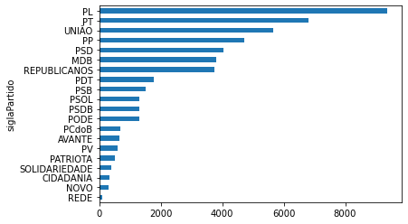
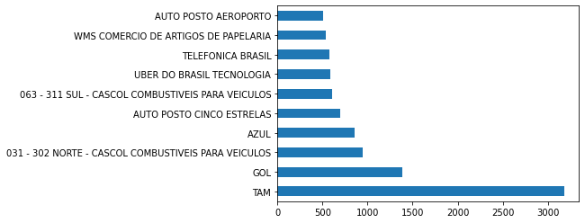
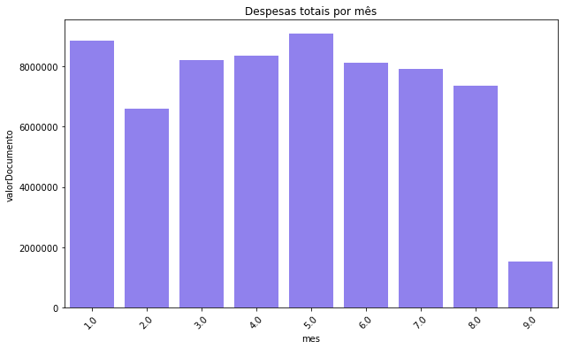

# ETL e Análise de Gastos dos Deputados Federais


## Objetivo

O objetivo deste projeto é extrair, transformar e carregar dados relacionados aos gastos dos deputados federais do Brasil. Em seguida, os dados serão analisados para identificar padrões de gastos do ano em exercicío.

<a id="ancora"></a>

# Índice

1. [Extração dos dados](#ancora1)
2. [Transformação](#ancora2)
3. [Carregamento(Load)](#ancora3)
4. [EDA](#ancora4)   
5. [Conclusão](#ancora5)   


<a id="ancora1"></a>

## Extração dos dados


A fonte de dados utilizada para este projeto é o portal de dados abertos da Câmara dos Deputados do Brasil, disponível no site [Dados Abertos](https://dadosabertos.camara.leg.br/swagger/api.html#api).
<p>A coleta de dados será realizada por meio do uso da API disponibilizada pelo portal. </p>


```python
# importação das bibliotecas
import pandas as pd
import requests
```


```python
# Realizando o request dos dados dos deputados
url = "https://dadosabertos.camara.leg.br/api/v2/deputados?ordem=ASC&ordenarPor=nome"
resultado = requests.get(url)
```


```python
# Convertendo em dataframe
deputados = pd.DataFrame(resultado.json()['dados'])
```


```python
deputados.head()
```


<div>
<style scoped>
    .dataframe tbody tr th:only-of-type {
        vertical-align: middle;
    }

    .dataframe tbody tr th {
        vertical-align: top;
    }

    .dataframe thead th {
        text-align: right;
    }
</style>
<table border="1" class="dataframe">
  <thead>
    <tr style="text-align: right;">
      <th></th>
      <th>id</th>
      <th>uri</th>
      <th>nome</th>
      <th>siglaPartido</th>
      <th>uriPartido</th>
      <th>siglaUf</th>
      <th>idLegislatura</th>
      <th>urlFoto</th>
      <th>email</th>
    </tr>
  </thead>
  <tbody>
    <tr>
      <th>0</th>
      <td>220593</td>
      <td>https://dadosabertos.camara.leg.br/api/v2/depu...</td>
      <td>Abilio Brunini</td>
      <td>PL</td>
      <td>https://dadosabertos.camara.leg.br/api/v2/part...</td>
      <td>MT</td>
      <td>57</td>
      <td>https://www.camara.leg.br/internet/deputado/ba...</td>
      <td>dep.abiliobrunini@camara.leg.br</td>
    </tr>
    <tr>
      <th>1</th>
      <td>204379</td>
      <td>https://dadosabertos.camara.leg.br/api/v2/depu...</td>
      <td>Acácio Favacho</td>
      <td>MDB</td>
      <td>https://dadosabertos.camara.leg.br/api/v2/part...</td>
      <td>AP</td>
      <td>57</td>
      <td>https://www.camara.leg.br/internet/deputado/ba...</td>
      <td>dep.acaciofavacho@camara.leg.br</td>
    </tr>
    <tr>
      <th>2</th>
      <td>220714</td>
      <td>https://dadosabertos.camara.leg.br/api/v2/depu...</td>
      <td>Adail Filho</td>
      <td>REPUBLICANOS</td>
      <td>https://dadosabertos.camara.leg.br/api/v2/part...</td>
      <td>AM</td>
      <td>57</td>
      <td>https://www.camara.leg.br/internet/deputado/ba...</td>
      <td>dep.adailfilho@camara.leg.br</td>
    </tr>
    <tr>
      <th>3</th>
      <td>221328</td>
      <td>https://dadosabertos.camara.leg.br/api/v2/depu...</td>
      <td>Adilson Barroso</td>
      <td>PL</td>
      <td>https://dadosabertos.camara.leg.br/api/v2/part...</td>
      <td>SP</td>
      <td>57</td>
      <td>https://www.camara.leg.br/internet/deputado/ba...</td>
      <td>dep.adilsonbarroso@camara.leg.br</td>
    </tr>
    <tr>
      <th>4</th>
      <td>204560</td>
      <td>https://dadosabertos.camara.leg.br/api/v2/depu...</td>
      <td>Adolfo Viana</td>
      <td>PSDB</td>
      <td>https://dadosabertos.camara.leg.br/api/v2/part...</td>
      <td>BA</td>
      <td>57</td>
      <td>https://www.camara.leg.br/internet/deputado/ba...</td>
      <td>dep.adolfoviana@camara.leg.br</td>
    </tr>
  </tbody>
</table>
</div>


```python
# conferindo o tamanho
deputados.shape
```


    (513, 9)


* **A variárvel 'deputados' é um dataframe que contém informações sobre os 513 deputados federais, cada linha representa um deputado e as colunas contêm diferentes atributos e informações sobre os mesmos.**

* **Certo agora já temos uma base de dados dos deputados, precisamos agora realizar o request dos gastos.**
* **Neste caso iremos realizar um request de 100 registros de cada id.**


```python
# Realizando o request dos gastos de 2023 dos deputatos 100 itens.
gastos = []
for id in deputados.id:
    url_despesa = "https://dadosabertos.camara.leg.br/api/v2/deputados/"
    url_despesa= url_despesa +str(id)+ "/despesas?ano=2023&itens=100&ordem=ASC&ordenarPor=ano"    
    resposta = requests.get(url_despesa)
    gasto = pd.DataFrame(resposta.json()['dados'])
    gasto['id'] = id
    gastos.append(gasto)       
```


```python
# Foram coletados 100 registros de cada deputado para esse exemplo.
len(gastos[512])
```


    100


```python
# 100 linhas e 18 colunas.
gastos[0].shape
```


    (100, 18)


```python
# visualizando os 5 ultimos registros do primeiro id.
gastos[0].tail()
```


<div>
<style scoped>
    .dataframe tbody tr th:only-of-type {
        vertical-align: middle;
    }

    .dataframe tbody tr th {
        vertical-align: top;
    }

    .dataframe thead th {
        text-align: right;
    }
</style>
<table border="1" class="dataframe">
  <thead>
    <tr style="text-align: right;">
      <th></th>
      <th>ano</th>
      <th>mes</th>
      <th>tipoDespesa</th>
      <th>codDocumento</th>
      <th>tipoDocumento</th>
      <th>codTipoDocumento</th>
      <th>dataDocumento</th>
      <th>numDocumento</th>
      <th>valorDocumento</th>
      <th>urlDocumento</th>
      <th>nomeFornecedor</th>
      <th>cnpjCpfFornecedor</th>
      <th>valorLiquido</th>
      <th>valorGlosa</th>
      <th>numRessarcimento</th>
      <th>codLote</th>
      <th>parcela</th>
      <th>id</th>
    </tr>
  </thead>
  <tbody>
    <tr>
      <th>95</th>
      <td>2023</td>
      <td>4</td>
      <td>COMBUSTÍVEIS E LUBRIFICANTES.</td>
      <td>7553208</td>
      <td>Nota Fiscal</td>
      <td>0</td>
      <td>2023-04-17</td>
      <td>196407</td>
      <td>183.85</td>
      <td>https://www.camara.leg.br/cota-parlamentar/doc...</td>
      <td>CENTRO DE SERVS FRANGO ASSADO NORTE LT</td>
      <td>02896671001937</td>
      <td>183.85</td>
      <td>0.0</td>
      <td></td>
      <td>1938971</td>
      <td>0</td>
      <td>220593</td>
    </tr>
    <tr>
      <th>96</th>
      <td>2023</td>
      <td>8</td>
      <td>COMBUSTÍVEIS E LUBRIFICANTES.</td>
      <td>7602582</td>
      <td>Nota Fiscal Eletrônica</td>
      <td>4</td>
      <td>2023-08-19</td>
      <td>130045</td>
      <td>86.03</td>
      <td>http://www.camara.leg.br/cota-parlamentar/nota...</td>
      <td>COMERCIAL 364 DE COMBUSTIVEIS LTDA</td>
      <td>27744555000102</td>
      <td>86.03</td>
      <td>0.0</td>
      <td></td>
      <td>1965161</td>
      <td>0</td>
      <td>220593</td>
    </tr>
    <tr>
      <th>97</th>
      <td>2023</td>
      <td>2</td>
      <td>COMBUSTÍVEIS E LUBRIFICANTES.</td>
      <td>7499508</td>
      <td>Nota Fiscal Eletrônica</td>
      <td>4</td>
      <td>2023-02-16</td>
      <td>7121</td>
      <td>153.13</td>
      <td>http://www.camara.leg.br/cota-parlamentar/nota...</td>
      <td>COMERCIAL AMAZONIA 02 DE PETROLEO EIRELI</td>
      <td>09001879000322</td>
      <td>153.13</td>
      <td>0.0</td>
      <td></td>
      <td>1909326</td>
      <td>0</td>
      <td>220593</td>
    </tr>
    <tr>
      <th>98</th>
      <td>2023</td>
      <td>2</td>
      <td>COMBUSTÍVEIS E LUBRIFICANTES.</td>
      <td>7501717</td>
      <td>Nota Fiscal Eletrônica</td>
      <td>4</td>
      <td>2023-02-20</td>
      <td>7130</td>
      <td>152.94</td>
      <td>http://www.camara.leg.br/cota-parlamentar/nota...</td>
      <td>COMERCIAL AMAZONIA 02 DE PETROLEO EIRELI</td>
      <td>09001879000322</td>
      <td>152.94</td>
      <td>0.0</td>
      <td></td>
      <td>1910831</td>
      <td>0</td>
      <td>220593</td>
    </tr>
    <tr>
      <th>99</th>
      <td>2023</td>
      <td>2</td>
      <td>COMBUSTÍVEIS E LUBRIFICANTES.</td>
      <td>7502535</td>
      <td>Nota Fiscal Eletrônica</td>
      <td>4</td>
      <td>2023-02-22</td>
      <td>7138</td>
      <td>144.48</td>
      <td>http://www.camara.leg.br/cota-parlamentar/nota...</td>
      <td>COMERCIAL AMAZONIA 02 DE PETROLEO EIRELI</td>
      <td>09001879000322</td>
      <td>144.48</td>
      <td>0.0</td>
      <td></td>
      <td>1910831</td>
      <td>0</td>
      <td>220593</td>
    </tr>
  </tbody>
</table>
</div>


[voltar](#ancora)

<a id="ancora2"></a>

## Transformação 


```python
# verificando os atributos
deputados.columns 
```


    Index(['id', 'uri', 'nome', 'siglaPartido', 'uriPartido', 'siglaUf',
           'idLegislatura', 'urlFoto', 'email'],
          dtype='object')


* **Para esse estudo vamos utilizar apenas os ['id', 'nome', 'siglaPartido','siglaUf','idLegislatura']**


```python
deputados = deputados[['id', 'nome', 'siglaPartido','siglaUf','idLegislatura']]
deputados.head()
```


<div>
<style scoped>
    .dataframe tbody tr th:only-of-type {
        vertical-align: middle;
    }

    .dataframe tbody tr th {
        vertical-align: top;
    }

    .dataframe thead th {
        text-align: right;
    }
</style>
<table border="1" class="dataframe">
  <thead>
    <tr style="text-align: right;">
      <th></th>
      <th>id</th>
      <th>nome</th>
      <th>siglaPartido</th>
      <th>siglaUf</th>
      <th>idLegislatura</th>
    </tr>
  </thead>
  <tbody>
    <tr>
      <th>0</th>
      <td>220593</td>
      <td>Abilio Brunini</td>
      <td>PL</td>
      <td>MT</td>
      <td>57</td>
    </tr>
    <tr>
      <th>1</th>
      <td>204379</td>
      <td>Acácio Favacho</td>
      <td>MDB</td>
      <td>AP</td>
      <td>57</td>
    </tr>
    <tr>
      <th>2</th>
      <td>220714</td>
      <td>Adail Filho</td>
      <td>REPUBLICANOS</td>
      <td>AM</td>
      <td>57</td>
    </tr>
    <tr>
      <th>3</th>
      <td>221328</td>
      <td>Adilson Barroso</td>
      <td>PL</td>
      <td>SP</td>
      <td>57</td>
    </tr>
    <tr>
      <th>4</th>
      <td>204560</td>
      <td>Adolfo Viana</td>
      <td>PSDB</td>
      <td>BA</td>
      <td>57</td>
    </tr>
  </tbody>
</table>
</div>


* **Vamos concatenar os 513 ids em um único dataframe usando o concat.**


```python
# Concatenando 
total = pd.concat(gastos)
```


```python
len(total)
```


    48861


```python
total.tail()
```


<div>
<style scoped>
    .dataframe tbody tr th:only-of-type {
        vertical-align: middle;
    }

    .dataframe tbody tr th {
        vertical-align: top;
    }

    .dataframe thead th {
        text-align: right;
    }
</style>
<table border="1" class="dataframe">
  <thead>
    <tr style="text-align: right;">
      <th></th>
      <th>ano</th>
      <th>mes</th>
      <th>tipoDespesa</th>
      <th>codDocumento</th>
      <th>tipoDocumento</th>
      <th>codTipoDocumento</th>
      <th>dataDocumento</th>
      <th>numDocumento</th>
      <th>valorDocumento</th>
      <th>urlDocumento</th>
      <th>nomeFornecedor</th>
      <th>cnpjCpfFornecedor</th>
      <th>valorLiquido</th>
      <th>valorGlosa</th>
      <th>numRessarcimento</th>
      <th>codLote</th>
      <th>parcela</th>
      <th>id</th>
    </tr>
  </thead>
  <tbody>
    <tr>
      <th>95</th>
      <td>2023.0</td>
      <td>8.0</td>
      <td>COMBUSTÍVEIS E LUBRIFICANTES.</td>
      <td>7601638.0</td>
      <td>Nota Fiscal Eletrônica</td>
      <td>4.0</td>
      <td>2023-08-29</td>
      <td>1332250</td>
      <td>250.00</td>
      <td>http://www.camara.leg.br/cota-parlamentar/nota...</td>
      <td>COMERCIAL DE COMBUSTIVEIS PLANETARIO LTDA.</td>
      <td>01157271000118</td>
      <td>250.00</td>
      <td>0.0</td>
      <td></td>
      <td>1964622.0</td>
      <td>0.0</td>
      <td>220552</td>
    </tr>
    <tr>
      <th>96</th>
      <td>2023.0</td>
      <td>3.0</td>
      <td>COMBUSTÍVEIS E LUBRIFICANTES.</td>
      <td>7513661.0</td>
      <td>Nota Fiscal Eletrônica</td>
      <td>4.0</td>
      <td>2023-03-11</td>
      <td>575375</td>
      <td>217.75</td>
      <td>http://www.camara.leg.br/cota-parlamentar/nota...</td>
      <td>COMERCIO DE COMBUSTIVEIS FLORESTAL LTDA</td>
      <td>02558109000921</td>
      <td>217.75</td>
      <td>0.0</td>
      <td></td>
      <td>1916796.0</td>
      <td>0.0</td>
      <td>220552</td>
    </tr>
    <tr>
      <th>97</th>
      <td>2023.0</td>
      <td>8.0</td>
      <td>COMBUSTÍVEIS E LUBRIFICANTES.</td>
      <td>7585426.0</td>
      <td>Nota Fiscal Eletrônica</td>
      <td>4.0</td>
      <td>2023-08-06</td>
      <td>2614301</td>
      <td>245.96</td>
      <td>http://www.camara.leg.br/cota-parlamentar/nota...</td>
      <td>COML BUFFON COMB E TRANSP LTDA - POSTO 26</td>
      <td>93489243002674</td>
      <td>226.06</td>
      <td>19.9</td>
      <td></td>
      <td>1956583.0</td>
      <td>0.0</td>
      <td>220552</td>
    </tr>
    <tr>
      <th>98</th>
      <td>2023.0</td>
      <td>7.0</td>
      <td>COMBUSTÍVEIS E LUBRIFICANTES.</td>
      <td>7585374.0</td>
      <td>Nota Fiscal Eletrônica</td>
      <td>4.0</td>
      <td>2023-07-12</td>
      <td>2220367</td>
      <td>251.52</td>
      <td>http://www.camara.leg.br/cota-parlamentar/nota...</td>
      <td>COML BUFFON COMB E TRANSP LTDA - POSTO 47</td>
      <td>93489243004707</td>
      <td>251.52</td>
      <td>0.0</td>
      <td></td>
      <td>1956581.0</td>
      <td>0.0</td>
      <td>220552</td>
    </tr>
    <tr>
      <th>99</th>
      <td>2023.0</td>
      <td>8.0</td>
      <td>COMBUSTÍVEIS E LUBRIFICANTES.</td>
      <td>7601513.0</td>
      <td>Nota Fiscal Eletrônica</td>
      <td>4.0</td>
      <td>2023-08-25</td>
      <td>2255317</td>
      <td>249.66</td>
      <td>http://www.camara.leg.br/cota-parlamentar/nota...</td>
      <td>COML BUFFON COMB E TRANSP LTDA - POSTO 47</td>
      <td>93489243004707</td>
      <td>249.66</td>
      <td>0.0</td>
      <td></td>
      <td>1964622.0</td>
      <td>0.0</td>
      <td>220552</td>
    </tr>
  </tbody>
</table>
</div>


```python
total.shape
```


    (48861, 18)


```python
# verificando valores ausentes
total.isnull().sum()
```


    ano                     0
    mes                     0
    tipoDespesa             0
    codDocumento            0
    tipoDocumento           0
    codTipoDocumento        0
    dataDocumento         271
    numDocumento            0
    valorDocumento          0
    urlDocumento         7800
    nomeFornecedor          0
    cnpjCpfFornecedor       0
    valorLiquido            0
    valorGlosa              0
    numRessarcimento        0
    codLote                 0
    parcela                 0
    id                      0
    dtype: int64


```python
# Removendo os atributos que possuem valores ausentes para esse exemplo.
del total['dataDocumento']
del total['urlDocumento']
```


```python
total.head()
```


<div>
<style scoped>
    .dataframe tbody tr th:only-of-type {
        vertical-align: middle;
    }

    .dataframe tbody tr th {
        vertical-align: top;
    }

    .dataframe thead th {
        text-align: right;
    }
</style>
<table border="1" class="dataframe">
  <thead>
    <tr style="text-align: right;">
      <th></th>
      <th>ano</th>
      <th>mes</th>
      <th>tipoDespesa</th>
      <th>codDocumento</th>
      <th>tipoDocumento</th>
      <th>codTipoDocumento</th>
      <th>numDocumento</th>
      <th>valorDocumento</th>
      <th>nomeFornecedor</th>
      <th>cnpjCpfFornecedor</th>
      <th>valorLiquido</th>
      <th>valorGlosa</th>
      <th>numRessarcimento</th>
      <th>codLote</th>
      <th>parcela</th>
      <th>id</th>
    </tr>
  </thead>
  <tbody>
    <tr>
      <th>0</th>
      <td>2023.0</td>
      <td>5.0</td>
      <td>MANUTENÇÃO DE ESCRITÓRIO DE APOIO À ATIVIDADE ...</td>
      <td>7552621.0</td>
      <td>Nota Fiscal</td>
      <td>0.0</td>
      <td>11533052023001</td>
      <td>43.2</td>
      <td>AGUAS CUIABA S.A</td>
      <td>14995581000153</td>
      <td>43.2</td>
      <td>0.0</td>
      <td></td>
      <td>1938600.0</td>
      <td>0.0</td>
      <td>220593</td>
    </tr>
    <tr>
      <th>1</th>
      <td>2023.0</td>
      <td>6.0</td>
      <td>MANUTENÇÃO DE ESCRITÓRIO DE APOIO À ATIVIDADE ...</td>
      <td>7587236.0</td>
      <td>Recibos/Outros</td>
      <td>1.0</td>
      <td>11533062023001</td>
      <td>43.2</td>
      <td>AGUAS CUIABA S.A</td>
      <td>14995581000153</td>
      <td>43.2</td>
      <td>0.0</td>
      <td></td>
      <td>1957493.0</td>
      <td>0.0</td>
      <td>220593</td>
    </tr>
    <tr>
      <th>2</th>
      <td>2023.0</td>
      <td>7.0</td>
      <td>MANUTENÇÃO DE ESCRITÓRIO DE APOIO À ATIVIDADE ...</td>
      <td>7587239.0</td>
      <td>Nota Fiscal</td>
      <td>0.0</td>
      <td>11533072023001</td>
      <td>43.2</td>
      <td>AGUAS CUIABA S.A</td>
      <td>14995581000153</td>
      <td>43.2</td>
      <td>0.0</td>
      <td></td>
      <td>1957494.0</td>
      <td>0.0</td>
      <td>220593</td>
    </tr>
    <tr>
      <th>3</th>
      <td>2023.0</td>
      <td>8.0</td>
      <td>MANUTENÇÃO DE ESCRITÓRIO DE APOIO À ATIVIDADE ...</td>
      <td>7605225.0</td>
      <td>Nota Fiscal</td>
      <td>0.0</td>
      <td>11533082023001</td>
      <td>43.2</td>
      <td>AGUAS CUIABA S.A</td>
      <td>14995581000153</td>
      <td>43.2</td>
      <td>0.0</td>
      <td></td>
      <td>1966665.0</td>
      <td>0.0</td>
      <td>220593</td>
    </tr>
    <tr>
      <th>4</th>
      <td>2023.0</td>
      <td>4.0</td>
      <td>MANUTENÇÃO DE ESCRITÓRIO DE APOIO À ATIVIDADE ...</td>
      <td>7538426.0</td>
      <td>Nota Fiscal</td>
      <td>0.0</td>
      <td>s/n</td>
      <td>43.2</td>
      <td>AGUAS CUIABA S.A</td>
      <td>14995581000153</td>
      <td>43.2</td>
      <td>0.0</td>
      <td></td>
      <td>1931086.0</td>
      <td>0.0</td>
      <td>220593</td>
    </tr>
  </tbody>
</table>
</div>


```python
# verificando a distribuição do atributo numRessarcimento
total.numRessarcimento.value_counts()
```


         42155
    0     6706
    Name: numRessarcimento, dtype: int64


* **nesse exemplo vamos remover o atributo 'numRessarcimento' também**.


```python
del total['numRessarcimento']
```


```python
total.head()
```


<div>
<style scoped>
    .dataframe tbody tr th:only-of-type {
        vertical-align: middle;
    }

    .dataframe tbody tr th {
        vertical-align: top;
    }

    .dataframe thead th {
        text-align: right;
    }
</style>
<table border="1" class="dataframe">
  <thead>
    <tr style="text-align: right;">
      <th></th>
      <th>ano</th>
      <th>mes</th>
      <th>tipoDespesa</th>
      <th>codDocumento</th>
      <th>tipoDocumento</th>
      <th>codTipoDocumento</th>
      <th>numDocumento</th>
      <th>valorDocumento</th>
      <th>nomeFornecedor</th>
      <th>cnpjCpfFornecedor</th>
      <th>valorLiquido</th>
      <th>valorGlosa</th>
      <th>codLote</th>
      <th>parcela</th>
      <th>id</th>
    </tr>
  </thead>
  <tbody>
    <tr>
      <th>0</th>
      <td>2023.0</td>
      <td>5.0</td>
      <td>MANUTENÇÃO DE ESCRITÓRIO DE APOIO À ATIVIDADE ...</td>
      <td>7552621.0</td>
      <td>Nota Fiscal</td>
      <td>0.0</td>
      <td>11533052023001</td>
      <td>43.2</td>
      <td>AGUAS CUIABA S.A</td>
      <td>14995581000153</td>
      <td>43.2</td>
      <td>0.0</td>
      <td>1938600.0</td>
      <td>0.0</td>
      <td>220593</td>
    </tr>
    <tr>
      <th>1</th>
      <td>2023.0</td>
      <td>6.0</td>
      <td>MANUTENÇÃO DE ESCRITÓRIO DE APOIO À ATIVIDADE ...</td>
      <td>7587236.0</td>
      <td>Recibos/Outros</td>
      <td>1.0</td>
      <td>11533062023001</td>
      <td>43.2</td>
      <td>AGUAS CUIABA S.A</td>
      <td>14995581000153</td>
      <td>43.2</td>
      <td>0.0</td>
      <td>1957493.0</td>
      <td>0.0</td>
      <td>220593</td>
    </tr>
    <tr>
      <th>2</th>
      <td>2023.0</td>
      <td>7.0</td>
      <td>MANUTENÇÃO DE ESCRITÓRIO DE APOIO À ATIVIDADE ...</td>
      <td>7587239.0</td>
      <td>Nota Fiscal</td>
      <td>0.0</td>
      <td>11533072023001</td>
      <td>43.2</td>
      <td>AGUAS CUIABA S.A</td>
      <td>14995581000153</td>
      <td>43.2</td>
      <td>0.0</td>
      <td>1957494.0</td>
      <td>0.0</td>
      <td>220593</td>
    </tr>
    <tr>
      <th>3</th>
      <td>2023.0</td>
      <td>8.0</td>
      <td>MANUTENÇÃO DE ESCRITÓRIO DE APOIO À ATIVIDADE ...</td>
      <td>7605225.0</td>
      <td>Nota Fiscal</td>
      <td>0.0</td>
      <td>11533082023001</td>
      <td>43.2</td>
      <td>AGUAS CUIABA S.A</td>
      <td>14995581000153</td>
      <td>43.2</td>
      <td>0.0</td>
      <td>1966665.0</td>
      <td>0.0</td>
      <td>220593</td>
    </tr>
    <tr>
      <th>4</th>
      <td>2023.0</td>
      <td>4.0</td>
      <td>MANUTENÇÃO DE ESCRITÓRIO DE APOIO À ATIVIDADE ...</td>
      <td>7538426.0</td>
      <td>Nota Fiscal</td>
      <td>0.0</td>
      <td>s/n</td>
      <td>43.2</td>
      <td>AGUAS CUIABA S.A</td>
      <td>14995581000153</td>
      <td>43.2</td>
      <td>0.0</td>
      <td>1931086.0</td>
      <td>0.0</td>
      <td>220593</td>
    </tr>
  </tbody>
</table>
</div>


```python
# Removendo linhas duplicadas se houver.
print(total.shape)
total.drop_duplicates()
print(total.shape)
```

    (48861, 15)
    (48861, 15)
    


```python
total.info()
```

    <class 'pandas.core.frame.DataFrame'>
    Int64Index: 48861 entries, 0 to 99
    Data columns (total 15 columns):
     #   Column             Non-Null Count  Dtype  
    ---  ------             --------------  -----  
     0   ano                48861 non-null  float64
     1   mes                48861 non-null  float64
     2   tipoDespesa        48861 non-null  object 
     3   codDocumento       48861 non-null  float64
     4   tipoDocumento      48861 non-null  object 
     5   codTipoDocumento   48861 non-null  float64
     6   numDocumento       48861 non-null  object 
     7   valorDocumento     48861 non-null  float64
     8   nomeFornecedor     48861 non-null  object 
     9   cnpjCpfFornecedor  48861 non-null  object 
     10  valorLiquido       48861 non-null  float64
     11  valorGlosa         48861 non-null  float64
     12  codLote            48861 non-null  float64
     13  parcela            48861 non-null  float64
     14  id                 48861 non-null  int64  
    dtypes: float64(9), int64(1), object(5)
    memory usage: 6.0+ MB
    


```python
total.describe()
```


<div>
<style scoped>
    .dataframe tbody tr th:only-of-type {
        vertical-align: middle;
    }

    .dataframe tbody tr th {
        vertical-align: top;
    }

    .dataframe thead th {
        text-align: right;
    }
</style>
<table border="1" class="dataframe">
  <thead>
    <tr style="text-align: right;">
      <th></th>
      <th>ano</th>
      <th>mes</th>
      <th>codDocumento</th>
      <th>codTipoDocumento</th>
      <th>valorDocumento</th>
      <th>valorLiquido</th>
      <th>valorGlosa</th>
      <th>codLote</th>
      <th>parcela</th>
      <th>id</th>
    </tr>
  </thead>
  <tbody>
    <tr>
      <th>count</th>
      <td>48861.0</td>
      <td>48861.000000</td>
      <td>4.886100e+04</td>
      <td>48861.000000</td>
      <td>48861.000000</td>
      <td>48861.000000</td>
      <td>48861.000000</td>
      <td>4.886100e+04</td>
      <td>48861.000000</td>
      <td>48861.000000</td>
    </tr>
    <tr>
      <th>mean</th>
      <td>2023.0</td>
      <td>4.433515</td>
      <td>6.536420e+06</td>
      <td>1.788277</td>
      <td>1348.981213</td>
      <td>1342.749334</td>
      <td>6.182949</td>
      <td>1.669583e+06</td>
      <td>0.000041</td>
      <td>180534.142138</td>
    </tr>
    <tr>
      <th>std</th>
      <td>0.0</td>
      <td>2.399120</td>
      <td>2.535850e+06</td>
      <td>1.879662</td>
      <td>3332.206329</td>
      <td>3323.586816</td>
      <td>125.331093</td>
      <td>6.661678e+05</td>
      <td>0.006398</td>
      <td>49932.747346</td>
    </tr>
    <tr>
      <th>min</th>
      <td>2023.0</td>
      <td>1.000000</td>
      <td>0.000000e+00</td>
      <td>0.000000</td>
      <td>-1812.260000</td>
      <td>-1812.260000</td>
      <td>0.000000</td>
      <td>0.000000e+00</td>
      <td>0.000000</td>
      <td>62881.000000</td>
    </tr>
    <tr>
      <th>25%</th>
      <td>2023.0</td>
      <td>2.000000</td>
      <td>7.500171e+06</td>
      <td>0.000000</td>
      <td>169.910000</td>
      <td>168.020000</td>
      <td>0.000000</td>
      <td>1.909773e+06</td>
      <td>0.000000</td>
      <td>160558.000000</td>
    </tr>
    <tr>
      <th>50%</th>
      <td>2023.0</td>
      <td>4.000000</td>
      <td>7.535658e+06</td>
      <td>1.000000</td>
      <td>270.020000</td>
      <td>269.000000</td>
      <td>0.000000</td>
      <td>1.929174e+06</td>
      <td>0.000000</td>
      <td>204457.000000</td>
    </tr>
    <tr>
      <th>75%</th>
      <td>2023.0</td>
      <td>6.000000</td>
      <td>7.572639e+06</td>
      <td>4.000000</td>
      <td>1147.330000</td>
      <td>1134.610000</td>
      <td>0.000000</td>
      <td>1.949787e+06</td>
      <td>0.000000</td>
      <td>220588.000000</td>
    </tr>
    <tr>
      <th>max</th>
      <td>2023.0</td>
      <td>9.000000</td>
      <td>7.612783e+06</td>
      <td>4.000000</td>
      <td>124000.000000</td>
      <td>124000.000000</td>
      <td>14050.000000</td>
      <td>1.970613e+06</td>
      <td>1.000000</td>
      <td>226553.000000</td>
    </tr>
  </tbody>
</table>
</div>


```python
#Verificando a distribuição por fornecedores.
total.nomeFornecedor.value_counts().head(25)
```


    TAM                                                              3113
    GOL                                                              1428
    031 - 302 NORTE - CASCOL COMBUSTIVEIS PARA VEICULOS LTDA          935
    AZUL                                                              865
    AUTO POSTO CINCO ESTRELAS LTDA                                    665
    UBER DO BRASIL TECNOLOGIA LTDA.                                   601
    063 - 311 SUL - CASCOL COMBUSTIVEIS PARA VEICULOS LTDA            597
    WMS COMERCIO DE ARTIGOS DE PAPELARIA LTDA-ME                      530
    AUTO POSTO AEROPORTO LTDA                                         501
    AUTO POSTO 303 NORTE LTDA                                         474
    CELULAR FUNCIONAL                                                 464
    Telefônica Brasil S.A. VIVO                                       413
    AMORETTO CAFES EXPRESSO LTDA                                      322
    076 - MELHOR 10 - CASCOL COMBUSTIVEIS PARA VEICULOS LTDA          290
    RAMAL                                                             271
    POSTO DA TORRE EIRELI EPP                                         256
    CEMIG DISTRIBUIÇÃO S.A.                                           254
    Claro NXT Telecomunicações S.A                                    230
    DRA4 DERIVADOS DE PETROLEO LTDA                                   230
    AUTO POSTO CONCORDE LTDA                                          228
    CEEE - Companhia Estadual de Distribuição de Energia Elétrica     213
    COMPANHIA DE ELETRICIDADE DO ESTADO DA BAHIA                      209
    BRASAL COMBUSTIVEIS LTDA                                          195
    BELIZE COMPANY AUTO POSTO LTDA                                    176
    AUTO POSTO JK LTDA                                                166
    Name: nomeFornecedor, dtype: int64


```python
#Convertendo a coluna em uma lista para podermos realizar uma verificação mais detalhada
fornecedores = total.nomeFornecedor.value_counts().index.tolist()
```


```python
# Ordenando para comparar erros de digitação etc...
fornecedores.sort(reverse=True)
fornecedores
```


    ['ÍRIO JOSÉ FELIPE DIAS LTDA',
     'É RIO PRETO COMUNICAÇÃO E MARKETING DIGITAL EIRELE',
     'Águas de Joinville',
     'zeta  paineis ltda',
     'viviani silveira',
     'viu internet',
     'viewclinic ltda',
     'viação novo horizonte LTDA',
     'via Brasil MT-246 Concessionaria',
     'valdiney maciel da silva',
     'use comunicações e telecomunicações ltda',
     'turbo cloud',
     'triunfo service ltda',
     'tecnodinamica importacao e comercio de m',
     'strutura desing comercio e locadora de bens moveis',
     'stada hoteis hangar scp',
     'sobral & Palacio petroleo LTDA',
     'serrana fm',
     'segpol serviços de segurança eletrônica ltda',
     'sTelefônica Brasil S.A. VIVO',
     'ronaldo guedine ribeiro',
     'rede grill auto posto LTDA',
     'real materias de limpeza e alimentos ltda',
     'print & copy comercio eireli me',
     'prefeitura municipal de campo grande',
     'posto z 14 ltda',
     'posto vargas de viçosa',
     'posto servsul',
     'posto sao domingos ltda',
     'posto santo onofre',
     'posto meneguetti',
     'posto fernão dias',
     'posto expresso amazonas',
     'posto eirelli',
     'posto de combustiveis martins ltda',
     'posto cidade encontro ltda',
     'posto campeao',
     'plano ltda',
     'organizações Sartori LTDA',
     'novo posto tucuman ltda',
     'novo posto seabra',
     'nelson benedito consultoria imobiliaria ltda',
     'mobile automotiva eireli',
     'mirante locadora limitada',
     'mc assessoria eireli me',
     'maxipred-assessoria predial lt',
     'mav - veículos e serviços ltda',
     'marcio ferreira neto informativo ms',
     'macedo e carlomagno comunicaçao e marketing ltda',
     'ludo comercio',
     'lucilandia lopes ferreira',
     'litoralmania',
     'lima administradora',
     'latam',
     'largo hotel manaus ltda',
     'javascript:;Kalunga SA',
     'h2L equipamentos e sistemas LTDA',
     'grafica imprimex comunicação visual',
     'grafer comercial',
     'gilmar niquini e filhos empreend.L',
     'gerson noguerol barros',
     'flickr pro monthly',
     'ff propaganda e marketting eireli',
     'eder florencio yanaguita',
     'coworking.etc.br',
     'corporate plaza buziness center',
     'consult web',
     'condominio do edificio dr justo antonio',
     'comunicação bras de sinal em midia outdoor ltda',
     'companhia jaguari de energia s.a.',
     'comercial mapes',
     'combustiveis ceu azul ltda',
     'cavis- propaganda e publicidade eireli',
     'av comunicação Multimidia LTDA',
     'auto posto xanxere',
     'auto posto saint gerard ltda',
     'auto posto neves',
     'auto posto fidelidade.',
     'auto posto ferreira e levenhagem',
     'auto posto duque tocantins ltda',
     'auto posto de combustiveis ferrari ltda',
     'auto posto confiança',
     'auto posto canpoo do areiao ltda',
     'auto posto beija flor',
     'auto posto arpoador ltda',
     'auto posto Parecis ltda',
     'auto posto Lorinho Jacareí',
     'antonio neres silva radio e tv ms',
     'ana celia oliveira matos',
     'americanas sa - 0854',
     'americanas sa - 0240',
     'americanas sa - 0035',
     'alex willian lopes',
     'afonso ferreira',
     'adobe systems software ireland ltd',
     'Zoom Vídeo Communications',
     'Zoom Video Communications Inc.',
     'Zoom Video Communications Inc',
     'Zoom Video Communications',
     'Zoom Video Communication Inc',
     'Zoom Video  Communications.inc',
     'Zoom Tecnologia LTDA',
     'Zoom Inc.',
     'Zoom Inc',
     'Zoantropo Filmes',
     'Zapier Inc.',
     'Zapier',
     'ZUMM EMPREENDIMENTOS LTDA',
     'ZUFFO SOLUCOES TECNOLOGICAS LTDA',
     'ZOOM VÍDEO COMMUNICATIONS INC.',
     'ZOOM VÍDEO COMMUNICATIONS',
     'ZOOM VIDEO COMUNICATIONS',
     'ZOOM VIDEO COMMUNICATIONS',
     'ZOOM',
     'ZONTA AUTO POSTO LTDA',
     'ZEMAR TURISMO LTDA',
     'ZAZ  NATAL LTDA',
     'ZARUR, COUTINHO E CARVALHO COMUNICACAO LTDA',
     'ZAPP PAPELARIA E INFORMATICA EIRELI-EPP',
     'ZANIN E VIEIRA LTDA',
     'ZANFER IMÓVEIS LTDA-ME',
     'ZANDONÁ GARUVA',
     'ZANDONA COMBUSTIVEIS',
     'ZANDONA & CIA LTDA',
     'ZAISOV COMERCIO DE COMBUSTIVEIS LTDA',
     'ZACHEU & ZACHEU EMBALAGENS LTDA EPP',
     'Yasmin Breckenfeld Reck 066779227925',
     'Yalla Transportes e Serviços LTDA',
     'YNOVE COPIADORAS,  COM. DE MAQ. COPIADORAS, SUPRIMENTOS LTDA',
     'YES LOCACAO DE IMOVEIS LTDA',
     'YELLOW DATA - SOLUÇÕESINTELIGENTES EM TI LTDA',
     'YELLOW DATA - SOLUCOES INTELIGENTES EM TI LTDA.',
     'YARA MARIA LIRA PAIVA E SILVA',
     'YAMAGUCHI EMPREENDIMENTOS LTDA',
     'Y V R GOMES COMUNICAÇÃO E MIDIA LTDA',
     'Y V R GOMES COMUNICACAO E MIDIA LTDA',
     'XIQUE XIQUE ASA SUL',
     'XIMENES NEGÓCIOS IMOBILIÁRIOS',
     'XIMENES NEGOCIOS IMOBILIARIOS LTDA',
     'XAVIER & DEGGERONE LTDA.',
     'Warley Pereira do Nascimento',
     'Waleska Aparecida Rocha dos Anjos',
     'WS COMERCIO DE DERIVADOS DE PETROLEO E LUBRIFICANTE EIRELI',
     'WS COMERCIO DE COMBUSTIVEIS',
     'WORLDNET / NBS ARIQUEMES',
     'WORLD PAPER PAPELARIA LIVRARIA E INFORMATICA LTDA',
     'WORKING ASSOCIAÇÃO DE INTEGRAÇÃO PROFISSIONAL',
     'WORDFENCE - INOVE',
     'WN MOREIRA & CIA LTDA',
     'WMS SUPERMERCADOS DO BRASIL LTDA.',
     'WMS SUPERMERCADOS DO BRASIL LTDA',
     'WMS COMERCIO DE ARTIGOS DE PAPELARIA LTDA-ME.',
     'WMS COMERCIO DE ARTIGOS DE PAPELARIA LTDA-ME',
     'WMS COMERCIO DE ARTIGOS DE PAPELARIA LTDA',
     'WL COMERCIO DE COMBUSTIVEIS LTDA',
     'WJJ COMERCIO DE DERIVADOS DE PETROLEO LTDA',
     'WISETECHTI',
     'WISETECH - LOCADORA DE EQUIPAMENTOS ELETRONICOS LTDA',
     'WINDSOR ADMINISTRAÇÃO DE HOTEIS E SERVIÇOS LTDA',
     'WINDSOR ADMINISTRACAO DE HOTEIS E SERVICOS LTDA',
     'WILMA ANA NOGUEIRA SANTOS',
     'WILLIAN RODRIGUES DOS SANTOS',
     'WILKER CAMPOS CHAGAS',
     'WGTI SOLUCOES INTELIGENTES LTDA',
     'WGTI - SOLUCOES INTELIGENTES',
     'WG RIBEIRAO AUTO POSTO LTDA',
     'WF3 COMERCIO DE COMBUSTIVEIS LTDA',
     'WEVERSON SARMENTO DA PAIXÃO',
     'WELLINGTON SIQUEIRA SANTOS FILHO 78068118500',
     'WELLINGTON SIQUEIRA SANTOS FILHO',
     'WELLINGTON DE ALMEIDA GOMES',
     'WELLINGTON ANTONIO DA SILVA',
     'WELESON LOPES',
     'WEBERTY CARLOS CHAVES GEROLINETO',
     'WEBERTE BERNARDO LEMOS',
     'WDA TAXI AEREO LTDA - EPP',
     'WDA TAXI AEREO LTDA',
     'WAY SERVIÇOS DIGITAIS LTDA',
     'WAY SERVICOS DIGITAIS LTDA',
     'WASHINGTON ADM.IMOVEIS S/C LTDA',
     'WANG COMUNICAÇÃO LTDA',
     'WANG COMUNICACAO LTDA',
     'WANDYCLER MARCOS SOUZA DA SILVA JUNIOR',
     'WALTER TANNUS FREITAS',
     'WALMIR NOGUEIRA SANTOS',
     'WALESKA APARECIDA ROCHA DOS ANJOS 05626826190',
     'WALDERNEY BARBOSA PANTALEÃO',
     'WAGNER RONIERE MENEZES DE OLIVEIRA',
     'WAGNER GONÇALVES CAMPOS NETO',
     'WAD PAPELARIA MANGUEIRAL',
     'WAAP TECNOLOGIA DA INFORMACAO LTDA',
     'W.MENDES ASSIST.TÉC E LOCAÇÃO  DE ELETRODOMÉSTICOS',
     'W. A. BARRETO & CIA LTDA',
     'W S POSTO DE COMBUSTIVEIS LTDA',
     'W S M DA SILVA - ME',
     'W R D POSTO DE COMBUSTIVEIS LTDA',
     'W L VISANI LTDA',
     'Voz e Pesquisa Tocantins LTDA',
     'Vjsa ADM. DE CONDOMINIOS LTDA',
     'Vivo Telefonica do Brasil s/a',
     'Vivo - Telefonica Brasil S.A.',
     'Vivo',
     'Viva Bem Imobiliária LTDA',
     'Vital Brasil Empreendimentos Imobiliário SPE Ltda',
     'Virginia de França Dantas',
     'Vila Paladino Gastro Beer LTDA',
     'Vidanova Comercio de Alimentos LTDA',
     'Victor Savas Jacques 08154245906',
     'Victor Barros Jacobina Ribeiro 86088222530',
     'Vero Internet',
     'Valberlino Mota ME',
     'VYP GESTÃO DE NEGÓCIOS IMOBILIARIOS LTDA',
     'VSP PARTNER',
     'VSP INFO LTDA',
     'VRF COMERCIO DE PRODUTOS DE LIMPEZA LTDA',
     'VPL COMERCIO DE PETROLEO LTDA',
     'VOZ E PESQUISA TOCANTINS LTDA',
     'VOXLINK TECNOLOGIA LTDA',
     'VOCE TELECOMUNICACOES LTDA',
     'VN Construtora Limitada',
     'VML COMERCIO DE DERIVADOS DE PETROLEO LTDA',
     'VL Veículos Ltda - EPP',
     'VL VEICULOS LTDA',
     'VJSA ADMINISTRADORA DE CONDOMINIOS LTDA',
     'VIZION GESTAO DE NEGOCIOS EMPRESARIAIS LTDA',
     'VIX VITORIA INFORMATICA LTDA',
     'VIVO S.A.',
     'VIVO S.A',
     'VIVA NEGOCIOS IMOBILIARIOS & CONSULTORIA EM MARKETING LTDA',
     'VIVA BEM IMOBILIARIA LTDA',
     'VITÓRIA TECNOLOGIA DA INFORMAÇÃO LTDA',
     'VITORIA TECNOLOGIA DA INFORMACAO LTDA',
     'VITORIA REGIA COMERCIO DE PETROLEO LTDA',
     'VITORIA COMERCIO E TRANSPORTES LTDA',
     'VITOR ALMEIDA DE SOUZA 04089267242',
     'VISUAL OUTDOOR LTDA',
     'VISUAL CLIPAGEM',
     'VISTAR PRESTACAO DE SERVICOS DE DIGITACAO LTDA',
     'VIRTUAL COMERCIO E SERVIÇOS LTDA',
     'VIRTUAL COMERCIO E SERVICOS LTDA',
     'VIP.COM INFORMATICA E SERVIÇOS',
     'VINICIUS DELEVATI',
     'VINICIUS CANSANCAO E CIA LTDA',
     'VINICIUS BULIGON',
     'VILLELA PRODUÇÕES LTDA LCTV',
     'VILLAGE VEICULOS LTDA EPP',
     'VILA RICA COMBUSTIVEIS LTDA',
     'VILA DE GOIANA COMERCIO DE COMBUSTIVEIS LTDA',
     'VILA BELA COMERCIO DE COMBUSTIVEL LTDA',
     'VILA 202 COMERCIO DE ALIMENTOS LTDA',
     'VIGOR VIGILANCIA LTDA',
     'VIGHOR EMPREENDIMENTOS LTDA',
     'VIEWCLINIC LTDA',
     'VIEIRA DE SOUSA SOCIEDADE INDIVIDUAL DE ADVOCACIA',
     'VIDEOMAR REDE NORDESTE S/A',
     'VIDEO 1 E SELOS POSTAIS LTDA',
     'VICTOR SAVAS JACQUES 08154245906',
     'VICENDI COMERCIO DE ALIMENTOS LTDA',
     'VIBRA ENERGIA S.A',
     'VIATV EVENTOS LTDA.',
     'VIAPAULISTA S/A',
     'VIANA E VIEIRA LTDA',
     'VIACAO OURO E PRATA S A',
     'VIACAO NOVO HORIZONTE LTDA SSA',
     'VIACAO GARCIA LTDA',
     'VIA NORTE SUL COMÈRCIO DE COMBUSTIVEIS LTDA',
     'VIA NORTE SUL COMERCIO DE COMBUSTIVEIS LTDA',
     'VIA MIDIA PRODUCOES E SERVICOS LTDA',
     'VIA LOCADORA DE AUTOMOVEIS LTDA',
     'VIA COMBUSTIVEIS LTDA',
     'VETORIALNET INFORMÁTICA E SERVIÇO DE INTERNET LTDA',
     'VETORIALNET INFORMATICA E SERVICOS DE INTERNET LTDA',
     'VERISURE BRASIL MONITORAMENTO DE ALARMES S.A',
     'VERISURE BRASIL MONITORAMENTO',
     'VERBO COMUNICAÇÃO',
     'VERA FOGACA',
     'VER-O-FATO NOTICIAS LTDA',
     'VER BRASILIA COMUNICACAO LTDA',
     'VENERÁVEL ORDEM TERCEIRA SÃO FRANCISCO DA PENITENCIA DA CIDADE SP',
     'VENERAVEL ORDEM TERCEIRA DE SAO FRANCISCO DA PENITENCIA DA CIDADE DE SAO PAULO',
     'VELOSO COMERCIO DE COMBUSTIVEIS LTDA',
     'VELEIROS MAR HOTEL',
     'VEIA PRODUCOES, EVENTOS E MARKETING LTDA',
     'VEGA GRAFICA DIGITAL LTDA',
     'VDK COMERCIO DE COMBUSTIVEIS',
     'VASCONCELOS RESTAURENTE LTDA',
     'VARELA TANAN ADVOGADOS',
     'VANESSA RODRIGES FERNANDES',
     'VANDREI MARTINS DE OLIVEIRA',
     'VANAB POSTO DE SERV. E CONV. LTDA',
     'VALÉRIA COSTA GUIMARAES - ME',
     'VALTIARA A. D. M. PRATI',
     'VALPOSTO COMBUSTIVEIS LTDA',
     'VALPARAISO REPRESENTACAO COMERCIAL DE COMBUSTIVEIS LTDA',
     'VALOR LOCAÇÕES EIRELI - ME',
     'VALOR LOCACOES LTDA',
     'VALOR ECONOMICO S.A.',
     'VALID CERTIFICADORA DIGITAL LTDA',
     'VALENTIM & FERNANDES LTDA',
     'VALE INFORMATICA',
     'VALE IMÓVEIS - Sala 07',
     'VALE IMÓVEIS - Sala 06',
     'VALE IMÓVEIS - Sala 05',
     'VALE IMÓVEIS - Sala 04',
     'VALE IMÓVEIS',
     'VALE IMOVEIS LTDA',
     'VALE DOS CARAJÁS PARK HOTEL LTDA - EPP',
     'VALDISIA LOPES POSTOS EIRELI',
     'VALDIR DIAS ADVOGADOS ASSOCIADOS',
     'VALDEMARIN 4 COMERCIO DE COMBUSTIVEIS E DERIVADOS',
     'VALDEIR NICOLODI EIRELI EIRELI',
     'VALBA COMERCIO DE COMBUSTIVEIS LTDA',
     'V8 COMERCIO DE DERIVADOS DE PETROLEO LTDA',
     'V.I.P Segurança LTDA',
     'V. BRAMBILA E CIA LTDA',
     'V W SERVICOS EIRELI',
     'V T AQUINO LTDA',
     'V N CONSTRUTORA LTDA',
     'V K COMERCIO DE DERIVADOS DE PETROLEO LTDA ME',
     'V FRANCISCO DA SILVA EPP',
     'V B A FERREIRA  LTDA',
     'V ANVERSA SOLUCOES ADMINISTRATIVAS',
     'Unidas SA',
     'Umberto Imóveis Ltda',
     'UWBR VOX Telecomunicações S/A',
     'USINA DE LATICINIOS JUSSARA S A',
     'USE SERVICE TECNOLOGIA LTDA',
     'URISSANÊ COMUNICAÇÃO lLTDA',
     'URISSANE COMUNICACAO LTDA',
     'URBANISMO SERVIÇOS E EVENTOS LTDA',
     'URBANISMO SERVICOS E EVENTOS LTDA',
     'URBAN MATERIAIS PARA ESCRITORIO E UNIFORMES EM GERAL LTDA',
     'UPSIDE AGENCIA DIGITAL LTDA-ME',
     'UO INSTALAÇÕES, MONTAGEM, MIDIA E EVENTOS LTDA',
     'UNIÃO MATERIAIS DE ESCRITÓRIO LTDA',
     'UNIVERSO PETROLEO LTDA',
     'UNIVERSO ONLINE S/A',
     'UNINOTE SERVIÇOS GRÁFICOS',
     'UNINOTE SERVICOS GRAFICOS LTDA',
     'UNIDOS COM DE COMB LTDA',
     'UNIDAS S/A',
     'UNIDAS LOCADORA S.A.',
     'UNIDAS LOCADORA S.A',
     'UNICA TECNOLOGIA COMERCIAL LTDA.',
     'UNIAO TRANSP DE ENCOMENDAS E COM DE VEICULOS LTDA',
     'UNIAO COMERCIAL DE SERVICOS E PRODUTOS LTDA',
     'ULTRAMAQ MÁQUINAS E SERVIÇOS LTDA',
     'ULTRAMAQ MAQUINAS E SERVICOS LTDA',
     'UIRAMUTAM PALACE HOTEL',
     'UBERPRINT LTDA',
     'UBER DO BRASIL TECNOLOGIA LTDA.',
     'UBER DO BRASIL TECNOLOGIA LTDA',
     'UBER',
     'UBA PETRO LTDA',
     'U. C. MONTEIRO',
     'U T B COMERCIO DE COMBUSTIVEL E LUBRIFICANTES LTDA',
     'TÁXI LEGAL',
     'Três Marias Agropecuária e eventos Eireli-EPP',
     'Três Marias Agropecuária e Eventos Eireli-EPP',
     'Tropical Corretora de Imóveis e Construções LTDA',
     'Tri Hotel Caxias LTDA',
     'Tres Barras Combustiveis Ltda',
     'Transportadora Leal Ltda',
     'Topper Investimentos, Bens e Capital - Eireli',
     'Tokio Marine Seguradora SA',
     'Tim S.A.',
     'Tiffany Hotel Ltda',
     'Tiago Rodrigues',
     'Thiago Martins dos Santos ME',
     'Thaís Amélia de Oliveira Gomes',
     'Thais dos Santos Portilho de Paulo',
     'Thais Soares dos Santos Grupo ZMX',
     'Territorio Empreendimentos Imobiliarios',
     'Telefônica Brasil S/A',
     'Telefônica Brasil S.A. VIVO',
     'Telefônica Brasil S.A.',
     'Telefonica Brasil SA',
     'Telefonica Brasil S.a.',
     'Telefonica Brasil S.A.',
     'Tecno Indústria e Comércio de Computadores ltda.',
     'Technocopy Equipamentos Suprimentos e Servicos Ltd',
     'TWITTER BRASIL REDE DE INFORMACAO LTDA',
     'TURNPIKE 4321 AUTO POSTO BAR E LANCHONETE BAZAR E SERVICOS AUTOMOTIVOS LTDA.',
     'TURNPIKE 4321 AUTO POSTO BAR E LANCHONETE BAZAR E',
     'TUDO AZUL INFORMATICA E TECNOLOGIA LTDA - ME',
     'TUCUMA CENTER POSTO LTDA',
     'TTS SOLUÇÕES EM TI LTDA',
     'TTS SOLUCOES EM INFORMATICA LTDA',
     'TSM EMPREENDIMENTOS IMOBILIARIOS LTDA',
     'TS CONDOMINIOS E IMÓVEIS S/S LTDA',
     'TS COMERCIO DE ARTIGOS DE ARMARINHO LTDA',
     'TROPICAL GASOLINAS E SERV AUTOMOTIVOS LT',
     'TROPEIRO RESTAURANTE EIRELLI EPP',
     'TROCAUTO VEICULOS',
     'TRIUNFO SERVICE LTDA',
     'TRIPE COMUNICAÇÃO E SERVIÇOS DE CONSULTORIA EM PUBLICIDADE LTDA',
     'TRIPE COMUNICACAO E SERVICOS DE CONSULTORIA EM PUBLICIDADE LTDA',
     'TRIART COMUNICACAO E MARKETING LTDA',
     'TRIADE AGRIBUSINESS E ADMINISTRAÇÃO DE BENS PROPRIOS LTDA',
     'TREVO DERIVADOS DE PETROLEO LTDA',
     'TRES MARIAS AGROPECUARIA E EVENTOS LTDA',
     'TREM UAI COMERCIO VAREJISTA DE ALIMENTOS LTDA',
     'TRELRIUM COMERCIO DE COMBUSTIVEIS E CONVENIENCIA LTDA ME',
     'TRAQUETE COMERCIO DE COMBUSTIVEIS LTDA EPP',
     'TRANSSERVICE PETROLEO LTDA',
     'TRANSPORTES GRITSCH LTDA',
     'TRANSPORTES E COMERCIO NOVO HORIZONTE LTDA',
     'TRANSPIAUI PETROLEO LTDA',
     'TRANSMOURA LOCADORA DE VEICULOS LTDA.',
     'TRANSBELCAR TRANSPORTE DE VEICULOS LTDA',
     'TRANSBELCAR TRANSPORTE DE VEICULOS EIRELI',
     'TRAIRI COMERCIO DE DERIVADOS DE PETROLEO LTDA.',
     'TRAGGA RESTAURANTE LTDA',
     'TOURING - ECOPOSTOS COMBUSTIVEIS E SERVICOS LTDA',
     'TOUR DE FORCE PAPELARIA E INFORMATIC LTDA',
     'TOUR DE FORCE PAPELARIA E INFORMATI LTDA',
     'TOTE MIDIA OUTDOORS',
     'TOTALSERV - COM. SERV. E MANUTENCAO LTDA.',
     'TOTALGRAF GRAFICA E EDITORA LTDA',
     'TOTALGRAF GRAFICA E EDITORA EIRELI - EPP',
     'TORTATTO HOTEL LTDA',
     'TORRES COMERCIO E DERIVADOS DE PETROLEO LTDA',
     'TORRES COMERCIO DE COMBUSTIVEIS LTDA',
     'TORQUE CONSTRUCOES LTDA',
     'TOPPER INVESTIMENTOS, BENS E CAPITAL LTDA',
     'TOPCLEAN COMERCIO DE PRODUTOS DE HIGIENE LTDA',
     'TOP COMERCIO DE COMBUSTIVEIS LTDA',
     'TONINHO TRINTA AUTO POSTO',
     'TONER CO SERVS LTDA',
     'TOCA DO PEIXE',
     'TOBIAS BARRETO SEGURANCA E SERVICOS LTDA',
     'TMCB COMERCIO DE ALIMENTOS LTDA',
     'TJ COMUNICACAO LTDA',
     'TINTELIG TELECOMUNICAÇÕES LTDA',
     'TIM SA',
     'TIM S/A',
     'TIM S.A.',
     'TIM S.A',
     'TIGRAO COMERCIO DE COMB E DERIVADOS EIRELI',
     'TIGRA LAB ESTRATEGIA E COMUNICAÇÃO LTDA',
     'TIGRA LAB ESTRATEGIA E COMUNICACAO LTDA',
     'TIFOLI MOFARREJ SÃO PAULO HOTEL - POJUCA S/A',
     'TIC POSTO LTDA V',
     'TIC POSTO LTDA IV',
     'TIC E TAC DE RAMOS POSTO DE SERVICOS LTDA',
     'TIAGO SOARES DOS SANTOS',
     'TIAGO RIBAS SIQUEIRA',
     'TI85 CONSULTORIA EM TECNOLOGIA DA INFORMAÇÃO LTDA',
     'TI85 CONSULTORIA EM TECNOLOGIA DA INFORMACAO LTDA',
     'THUYA AUTO POSTO DE SERVICOS LTDA',
     'THOME E MESQUITA LTDA',
     'THM MAQUINAS SEMIAUTOMATICAS LTDA',
     'THIAGO VASCONCELOS MORAIS ME',
     'THIAGO VASCONCELOS MORAES',
     'THIAGO OSCALIS MARTINS',
     'THIAGO FONSECA COSTA',
     'THIAGO BIANCONI WIGGERT 21971525804',
     'THIAGO BARUDI 03645162917',
     'THERESINHA HEREDIA FASSARELLA EIRELI',
     'THE PLANT COMERCIO DE ALIMENTOS LTDA',
     'THE BETS TREINAMENTOS MARKETING E COMUNICACAO LTDA',
     'THAMIRES NAZARÉ DO NASCIMENTO',
     'TH COMÉRCIO DE MÁQUINAS E EQUIPAMENTOS LTDA',
     'TH COMERCIO DE MAQUINAS E EQUIPAMENTOS LTDA',
     'TERRITORIAL EMPREENDIMENTOS IMOBILIARIOS LTDA.',
     'TERRAL TAXI AEREO LTDA',
     'TERRA DO SOL DISTRIBUIDORA DE PAPELARIA E ESCRITORIO LTDA',
     'TERRA ASSESSORIA IMOBILIÁRIA LTDA.',
     'TEREZINHA DE JESUS PEDROSO',
     'TERESA C.O.DELCARO ME',
     'TEMPERATTO RESTAURANTE LTDA',
     'TELEMAXIMO SISTEMAS CONSULTORIA E SERVIÇOS LTDA - ME',
     'TELEMAXIMO SISTEMAS CONSULTORIA E SERVICOS LTDA',
     'TELEMAR NORTE LESTE S/A',
     'TELELOK LTDA',
     'TELELOK LOCAÇÃO DE MÓVEIS LTDA.',
     'TELEFÔNICA BRASIL S.A. - VIVO',
     'TELEFÔNICA BRASIL S.A.',
     'TELEFÔNICA BRASIL S.A',
     'TELEFONÔNICA BRASIL S.A',
     'TELEFONICA BRASIL S.A.',
     'TELEFONICA BRASIL  VIVO S.A.',
     'TELEFONIA BRASIL S.A - VIVO',
     'TELE TÁXI BELVEDERE',
     'TEIXEIRA GRAFICA E EDITORA LTDA.',
     'TECNOVETTI PRODUTOS E SERV. PARA ESCRITORIO LTDA',
     'TECNOPRINTER EA SUPRIMENTOS PARA IMPRESSORA EIRELI',
     'TECNOCOPY SERVICOS E LOCACAO DE EQUIPAMENTOS LTDA',
     'TECNOAR SERVIÇOS DE ENGENHARIA EIRELI',
     'TECNOAR SERVICOS DE ENGENHARIA LTDA',
     'TECNO INDUSTRIA E COMERCIO DE COMPUTADORES LTDA',
     'TECNICA INFORMATICA COMERCIO E REPRESENTACOES LTDA',
     'TECNEWS CORPORATION COMÉRCIO E SERVIÇO LTDA',
     'TECNEWS CORPORATION COMERCIO & SERVICOS LTDA',
     'TECNEGOCIOS SOLUÇÕES EM INFORMÁTICA LTDA-ME',
     'TECNEGOCIOS SOLUCOES EM INFORMATICA LTDA',
     'TECHNOCOPY EQUIPAMENTOS SUPRIMENTOS E SERVICOS LTDA',
     'TE MKT',
     'TDA COM. COMB. LTDA',
     'TAZZA COMERCIO DE MAQUINAS E INSUMOS LTDA',
     'TAZZA COMERCIO DE MAQUINAS E INSUMOS EIRELI  ME',
     'TAYPA RESTO BAR PERUANO LTDA',
     'TAXI AEREO VALE DO MADEIRA LTDA',
     'TAXI AEREO HERCULES LTDA.',
     'TAXCO LOCADORA DE BENS LTDA',
     'TAVARES COMERCIO DE COMBUSTIVEIS E LUBRIFICANTES LTDA',
     'TATIANE ADAMES COMERCIO E PAPELARIA LTDA',
     'TATIANA BARROS MAIA PIRES 35257887894',
     'TATIANA BARROS MAIA PIRES',
     'TARGINO COMERCIO DE COMBUSTIVEIS LTDA ME',
     'TARGET RENT A CAR LTDA',
     'TARCISO ANTONIO DE MEDEIROS CALADO FILHO',
     'TAPPARO E FIGUEIREDO TAPPARO LTDA',
     'TANIA CIRLEI SGARBOSSA ALVES EIRELI',
     'TAM LINHAS AEREAS S/A.',
     'TAM',
     'TALTO',
     'TALISMÃ PALLACE HOTEL',
     'TAKIT COMUNICACAO E TECNOLOGIA',
     'TAKEO MARUTA CONVENIENCIA - ME',
     'TAIKAN FAST SUSHI LTDA',
     'TAIKAN FAST FOOD SUSHI LTDA',
     'TAGUACENTRO COMER. DE DERIV. DE PETROLEO LTDA',
     'TAGG SERVICES LTDA',
     'TABITA MARINHO PRODUCOES E COMUNICACAO LTDA',
     'TABITA FERREIRA MARINHO PRODUÇÕES E COMUNICAÇÃO EIRELI',
     'TABITA FERREIRA MARINHO PRODUCOES E COMUNICACAO LTDA',
     'T. R. DOS SANTOS BEZERRA EPP',
     'T. DE JESUS PEDROSO',
     'T dos Reis Silva Eireli-TX Outdoor',
     'T DOS REIS SILVA LTDA',
     'São Luís Combustíveis Ltda.',
     'SÃO JOÃO COMÉRCIO DE COMBUSTÍVEIS LTDA',
     'Suplymax Suprimentos de Informática LTDA',
     'Supermercado VR Comercio de Alimentos',
     'Sudeste Foods Produtos Alimenticios',
     'Strike Media',
     'Streamyard, Inc.',
     'Streamyard',
     'Stream Yard, Inc.',
     'Steamyard, Inc.',
     'Solução Serviços para Condomínios Ltda',
     'Sol da Manha Posto e Garagem Ltda',
     'SoftHost - Empresa MH INT. REP. E INST. EM INFORMATICA LTDA',
     'Sky Serviços de Banda Larga Ltda',
     'Sintaxi',
     'Sindicato dos Jornalistas Profissionais do Município do Rio de Janeiro',
     'Simone Silva de Freitas Félix',
     'Silva e Ramos Comercio de Combustiveis Ltda',
     'Severino Pinheiro Vidal',
     'Serviço Autonomo de Agua e esgoto de Alagoinhas',
     'Sergio Guimarães Hardy',
     'Semalo Combustiveis Ltda',
     'Secretária  Municipal de fazenda',
     'Sanasa Campinas',
     'Safe Park Estacionamentos',
     'Sabor Na Brasa Costelaria Ltda - Me',
     'SYSCOIN TECNOLOGIA E SERVICOS LTDA',
     'SYSCOIN TECNOLOGIA E SERVICO LTDA - ME',
     'SYMA COMPUTADORES LTDA.',
     'SWEET PAPER PAPELARIA EIRELI',
     'SWAMY HOTEL - A. A. S. QUEIROZ',
     'SUSHI GOURMET RESTAURANTE LTDA',
     'SURF IN BOX MATERIAL ESPORTIVO LTDA - ME',
     'SUPRIMAQ EQUIPAMENTOS PARA ESCRITORIO EIRELI',
     'SUPREMA MOBILIDADES LTDA.',
     'SUPREMA MOBILIDADE LTDA',
     'SUPREMA COMERCIO DE ARTIGOS PARA LIMPEZA E FESTAS LTDA.',
     'SUPLYMAX SUPRIMENTOS DE INFORMATICA LTDA',
     'SUPERQUADRA BAR E RESTAURANTE LTDA',
     'SUPERMERCADOS BH',
     'SUPERMERCADO JACOMAR LTDA',
     'SUPERMERCADO BAHAMAS S/A',
     'SUPERINTENDENCIA DE AGUA E ESGOTO DE OURINHOS',
     'SUPER TROCA DE OLEO DIMAO',
     'SUPER POSTO TRIUNFO LTDA',
     'SUPER POSTO PALMEIRA LTDA',
     'SUPER POSTO JC LT',
     'SUPER POSTO EXPRESS LTDA.',
     'SUPER POSTO DOIS MIL LTDA',
     'SUPER POSTO BRASIL V LTDA',
     'SUPER POSTO 2000 LTDA',
     'SUPER GAMES COMERCIAL LTDA',
     'SUPER AUTO VEICULOS LTDA',
     'SUMO COMUNICAÇÃO E MARKETING LTDA',
     'SUMO COMUNICACAO E MARKETING LTDA',
     'SUMMIT HOTELARIA LTDA',
     'SUMICITY TELECOMUNICACOES S.A',
     'SULCOP COPIADORAS E SUPRIMENTOS LTDA',
     'SUELI TEREZINHA DE MORAIS ALMEIDA',
     'SUDOESTE COMERCIO DE PRODUTOS AUTOMOTIVOS LTDA',
     'SUDESTE FOODS PRODUTOS ALIMENTICIOS LTDA',
     'SUBCONDOMÍNIO DO COMPLEXO EMP. RM TRADE CENTER - AV. REPÚBLICA DO LÍBANO 251 - PINA - RECIFE/PE',
     'SUASSUNA FERNANDES ENGENHARIA S.A',
     'STV COMUNICACAO LTDA',
     'STUDIO AB GRAFICA E EDITORA LTDA',
     'STUDIO AB - CRIATIVIDADE VISUAL EIRELI - EPP',
     'STRUTURAL PARTICIPAÇÃO ADM IMOBILIÁRIA LTDA',
     'STRUTURAL PARTICIPACAO E ADMINISTRACAO IMOBILIARIA LTDA',
     'STRATUS CENTRO HOTEL LTDA ME',
     'STILO GRAFICA E EDITORA LTDA',
     'STILLUS TRANSPORTES',
     'STEVAM GREGORY ROCHA POLLON',
     'STELMAT TELEINFORMATICA LTDA',
     'STATUS RIO AUTO SERVIÇO LTDA',
     'STATIC TONER DO BRASIL LTDA.',
     'STATIC TONER DO BRASIL LTDA',
     'START AUTO POSTO',
     'STARBUCKS BRASIL COMERCIO DE CAFES LTDA',
     'STAR SHOPPING AUTO POSTO EIRELI',
     'STAR EAST COMERCIO DE COMBUSTIVEIS LTDA',
     'STANG & STANG LTDA',
     'STANG & STANG',
     'STAMPA OUTDOOR LTDA',
     'STAMPA OUTDOOR EIRELI',
     'SRX QUEZADO COMBUSTIVEIS E LUBRIFICANTES LTDA',
     'SRX QUEZADO COMBUSTIVEIS E LUBRIFICANTES EIRELI',
     'SRS SERVIÇOS LTDA EPP',
     'SR SAO PAULO COMERCIO VAREJISTA DE COMBUSTIVEIS LTDA',
     'SQS REI DO BACALHAU EIRELI',
     'SPOLETO SUDOESTE 100 COMERCIAL  DE ALIMENTOS',
     'SPARTA PLAN MEDIA COMUNICACAO LTDA',
     'SP VARIEDADES E IMPORTADOS SOCIEDADE UNIPESSOAL LTDA',
     'SP VARIEDADES E IMPORTADOS S. UNIPESSOAL LTDA',
     'SP POSTO - COMERCIO DE COMBUSTIVEIS PARA VEICULO LTDA',
     'SP PARK COMERCIO DE ALIMENTOS LTDA EPP',
     'SP HOUSE IMOBILIARIA E ADMINISTRADORA LTDA',
     'SP ATACADISTA DE ARMARINHOS LTDA',
     'SP ATACADISTA DE ARMARINHO LTDA',
     'SOUZACRE AGENCIA DE PUBLICIDADE LTDA',
     'SOUZA e VITAL LTDA',
     'SOUSA PETROLEO E SERVICOS LTDA',
     'SOUSA E ALVES COM DE DERIVADOS DE PETRÓLEO',
     'SOUL FLATS ADMINISTRADORA LTDA EPP',
     'SOU PRINT SERVICOS E COMERCIOS DE IMPRESSAO DE MATERIAL PUBLICITARIO LTDA',
     'SOS ALARMES',
     'SORTWEB STUDIO LTDA',
     'SONIA MARIA ASSAD MARTINS',
     'SONHO VERDE COMBUSTIVEIS LTDA',
     'SONAP SOCIEDADE NACIONAL DE PETROLEO LTDA',
     'SOMMAS COMBUSTIVEIS LTDA',
     'SOLUÇÃO NETWORK PROVEDOR LTDA',
     'SOLFESTA TURISMO LTDA',
     'SOLARYS SOLUCOES DIGITAIS LTDA',
     'SOL NASCENTE COMERCIO DE COMBUSTIVEIS LTDA',
     'SOL INVEST - HOTEL JARAGUA LTDA.',
     'SOL G.V.COELHO COMUNICAÇÃO E MARKETING',
     'SOL COMERCIO DE COMBUSTIVEIS LTDA',
     'SOF SUPER TROCA DE OLEO LTDA ME',
     'SOCIEDADE DE PETROLEO ARFLA LTDA',
     'SOCIEDADE COMERCIAL CAVALCANTI E FILHO LTDA',
     'SOCIEDADE COMERCIAL CANAA -LTDA',
     'SOCIEADE ANVERSA PARTICIPAÇÕES LTDA',
     'SOCIALBIZ COMUNICACAO ESTRATEGICA LTDA',
     'SOCIAL IMOVEIS MBS',
     'SOCIAL E MIDIA AGENCIA DE COMUNICACAO LTDA',
     'SOCIAL COMUNICACAO & JORNALISMO LTDA ME',
     'SOCIAL COMUNICACAO & JORNALISMO LTDA',
     'SOCAPE SOCIEDADE CAXIENSE DE PETROLEO LTDA',
     'SOBRAL E PALACIO PETROLEO LTDA',
     'SOBRAL COMERCIO E SERVICOS LTDA',
     'SOBRAL &amp; FILHOS COMERCIO DE COMBUSTIVEIS LTDA - PSG1',
     'SOBRAL & PALACIO PETROLEO LTDA',
     'SOARES REFRIGERACAO',
     'SOARES COMERCIO E SERVICOS EIRELI',
     'SOARES ASSESSORIACOMUNICAÇÃO E ESPORTE LTDA',
     'SOARES ASSESSORIA COMUNICACAO E ESPORTE LTDA',
     'SMART VEÍCULOS LTDA-ME',
     'SMART VEICULOS LTDA',
     'SMART SOLUÇÕES EM GESTÃO FINANCEIRA E EMPRESARIAL LTDA',
     'SMART SOLUCOES EM GESTAO FINANCEIRA E EMPRESARIAL LTDA',
     'SMAFF COMBUSTIVEIS LTDA',
     'SL EMPREENDIMENTOS IMOBILIARIOS LTDA',
     'SJ CARIRI ADM DE IMÓVEIS LTDA',
     'SJ ADMINISTRACAO DE IMOVEIS LTDA',
     'SJ ADMIMINSTRAÇÃO DE  IMOVEIS LTDA',
     'SISTEMAS CONVEX LOCAÇÃO DE PRODUTOS DE INFORMÁTICA LTDA.',
     'SISTEMA REGIONAL DE RADIODIFUSAO LTDA',
     'SISTEMA DE COMUNICACAO GUARACY LTDA',
     'SISTEMA CIDADE - C.A. DE OLIVEIRA SONORIZAÇÃO E DIVULGAÇÃO',
     'SISTEGON COMERCIO DE COMBUSTIVEIS LTDA',
     'SISNETTI INTEGRADORA DE SOLUCOES LTDA',
     'SIQUELERO SERRAZUL AUTO POSTO LTDA',
     'SIQUEIRA HOTEIS LTDA',
     'SINDTAXI',
     'SINDICATO DOS CONDUTORES AUTONOMOS DE TAXI DE SALVADOR - SINDITAXI',
     'SIND. DAS INDUSTRIAS SIDERÚGICAS DO OESTE DE MINAS - SINDIGUSA',
     'SIN- SISTEMAS INTELIGENTES LTDA - ME',
     'SIM REDE DE POSTOS LTDA - VACARIA MONTE CLARO',
     'SIM REDE DE POSTOS LTDA - TIO HUGO',
     'SIM REDE DE POSTOS LTDA - SAO SEBASTIAO DO CAI RETRO',
     'SIM REDE DE POSTOS LTDA - PORTAO HOFF',
     'SIM REDE DE POSTOS LTDA - POA SOUZA REIS',
     'SIM REDE DE POSTOS LTDA - POA FARRAPOS',
     'SIM REDE DE POSTOS LTDA - POA ECOPOSTO',
     'SIM REDE DE POSTOS LTDA - PASSO FUNDO BOQUEIRAO',
     'SIM REDE DE POSTOS LTDA - NOVA STA RITA',
     'SIM REDE DE POSTOS LTDA - NOVA SANTA RITA VALENTINA',
     'SIM REDE DE POSTOS LTDA - NOVA SANTA RITA SCUDERIA',
     'SIM REDE DE POSTOS LTDA - GARIBALDI BR470',
     'SIM REDE DE POSTOS LTDA - FREE WAY',
     'SIM REDE DE POSTOS LTDA - FL138 BARRA DO CHUI',
     'SIM REDE DE POSTOS LTDA - FARROUPILHA SANTO ANTONIO',
     'SIM REDE DE POSTOS LTDA - ESTRELA',
     'SIM REDE DE POSTOS LTDA - CAXIAS SAO CIRO',
     'SIM REDE DE POSTOS LTDA - CAXIAS PERIMETRAL NORTE',
     'SIM REDE DE POSTOS LTDA - CAXIAS MATTEO',
     'SIM REDE DE POSTOS LTDA - CAMAQUA PARADOURO',
     'SIM REDE DE POSTOS LTDA - APARECIDA',
     'SIM REDE DE POSTOS LTDA  - PORTAO HOFF',
     'SIM REDE DE POSTOS LTDA  - POA CEARA',
     'SIM REDE DE POSTOS LTDA  -  POA AV IPIRANGA',
     'SIM REDE DE POSTO LTDA',
     'SIM INTERNET LTDA',
     'SILVIA REGINA DE ANDRADES - ME',
     'SILVANO DE SOUSA COMERCIO DE COMBUSTIVEIS LTDA',
     'SILVANA VALIERIS BUENO DE ALMEIDA',
     'SILVANA BENETTI BISOTTO',
     'SILVA SOBRINHO COMBUSTIVEIS LTDA',
     'SILVA E SALES LTDA',
     'SILVA COMBUSTIVEL LTDA',
     'SILT SELF SERVICE EIRELI ME',
     'SILT SELF SERVICE EIRELI EPP',
     'SILAS PEREIRA DE ANDRADE 38528380106',
     'SIG COMERCIO DE COMBUSTIVEIS LTDA',
     'SIG COMERCIAL DE PAPEIS LTDA EPPI',
     'SIDNEI GERALDO BERTOLDI',
     'SIDNEI BANDEIRA ALVES - ME',
     'SHOPPING VIA LAGOS',
     'SHOPPING SHALOM COMERCIO E SERVICOS LTDA',
     'SHOPPING COML ABAST DE PROD PETROLEO C S LTDA',
     'SHOPPING COMERCIAL E ABAST DE PROD DE PETROLEO C S LTDA',
     'SHELDA VANESSA RIBEIRO MAGALHAES 07401155370',
     'SHELDA VANESSA RIBEIRO MAGALHAES',
     'SHEKINAH LOCACAO DE VEICULOS LTDA',
     'SHEKINAH LOCACAO DE VEICULOS EIRELI',
     'SHARMILIE MARTINS ASPERA TAVARES',
     'SG NACOES LTDA ME',
     'SFAN PKS ALIMENTOS LTDA',
     'SFAN PIER21 ALIMENTOS LTDA',
     'SEVILHA PALACE HOTEL',
     'SEVERINO S. LOPES & CIA. LTDA',
     'SEVERINO S LOPES E CIA LTDA',
     'SEVERINO ALMEIDA CHAVES POSTO CEARA 1',
     'SETE COPA CONSULTORIA E ENGENHARIA LTDA',
     'SERVIÇO DE ÁGUA E ESGOTO DE SOROCABA',
     'SERVIÇO AUTONOMO DE AGUA E ESGOTO',
     'SERVICO NACIONAL DE APRENDIZAGEM COMERCIAL:03682189000138',
     'SERVICO NACIONAL DE APRENDIZAGEM COMERCIAL SENAC',
     'SERVICO AUTONOMO MUNICIPAL DE AGUA E ESGOTO',
     'SERVICO AUTONOMO DE AGUA E ESGOTO',
     'SERVICENTRO NOSSA SENHORA APARECIDA LTDA',
     'SERVICAR S/A',
     'SERVHOST INTERNET LTDA ME',
     'SERVCAR SOLUÇÕES AUTOMOTIVAS LTDA ME',
     'SERVCAR SOLUCOES AUTOMOTIVAS LTDA',
     'SERV-RIO TERCEIRIZACAO E SERVICOS LTDA',
     'SERV RIO TERCEIRIZAÇÃO E SERVIÇOS',
     'SERV CAR DERIVADOS DE PETROLEO LTDA',
     'SERV AUTOM PONTA VERDE LTDA',
     'SERTRAN-SERVICOS DE TRANSITO LTDA',
     'SERRA DO RONCADOR HOTELARIA LTDA',
     'SERIDO COMERCIAL DE COMBUSTIVEIS DOMINGOS LTDA',
     'SERGIO MACHADO REIS EPP',
     'SERGIO MACHADO REIS',
     'SERGIO CLEBER DE SOUZA BARBOSA',
     'SERCOMTEL',
     'SERAUT AUTO POSTO LTDA',
     'SEQUEIRA E SEQUEIRA COMERCIO DE EQUIPAMENTOS LTDA',
     'SEQUEIRA & SEQUEIRA COMERCIO DE EQUIPAMENTOS LTDA',
     'SEPTIMA FILMES LTDA EPP',
     'SEPTIMA FILMES LTDA',
     'SENS-COM E COMB E LUBRIFICANTES',
     'SENNA LOCADORA DE AUTOMOVEIS LTDA',
     'SENGE- SINDICATO DOS ENGENHEIROS',
     'SENDINBLUE MARKETING',
     'SENDAS DISTRIBUIDORA S/A',
     'SENA COMUNICAÇÕES',
     'SEMAE Serviço Municipal de Agua e Esgoto',
     'SEM PARAR INSTITUIÇÃO DE PAGAMENTO LTDA',
     'SEM FRONTEIRAS NEGOCIOS IMOBILIARIOS LTDA',
     'SEM FRONTEIRAS - NEGÓCIOS IMOBILIÁRIOS LTDAS',
     'SEISELLES DISTRIBUIÇÃO E LOGÍSTICA EIRELI',
     'SEGPOL SERVICOS DE SEGURANCA ELETRONICA LTDA',
     'SEG NATAL SIST ELETRONICO DE ALARME LTDA',
     'SECRETARIA MUNICIPAL DE FAZENDA RJ',
     'SECRETARIA MUNICIPAL DE FAZENDA',
     'SECRETARIA MUNICIPAL DA FAZENDA SALVADOR',
     'SECRETARIA DE ESTADO DE FAZENDA DA BAHIA',
     'SECRETARIA DA FAZENDA',
     'SECREL SOLUCOES DE INFORMATICA LTDA',
     'SEC Móveis LTDA',
     'SEC MOVEIS LTDA',
     'SDB COMERCIO DE ALIMENTOS LTDA',
     'SD COMBUSTIVEIS LTDA',
     'SCM PARTICIPAÇÕES SA',
     'SCHONS SCHONS LTDA',
     'SCHEFFER INFORMÁTICA',
     'SCB ADMINISTRACAO DE BENS LTDA',
     'SCB - ADMINISTRACAO DE BENS LTDA.',
     'SC COMBUSTIVEIS LTDA',
     'SC ASSESSORIA DE COMUNICACAO LTDA',
     'SBGRILL SALVADOR RESTAURANTE LTDA',
     'SBB COMERCIO DE COMBUSTIVEL LTDA',
     'SBA ABASTECEDORA E FRETES ROD. LTDA',
     'SB SERVIÇOS EM TECNOLOGIA EIRELI- EPP',
     'SB CHURRASCARIA LTDA',
     'SAÍDA SUL POSTOS E SERVIÇOS LTDA',
     'SAULO BATISTA CUNHA',
     'SARAIVA COMÉRCIO DE COMBUSTÍVEIS LTDA',
     'SARA ONLINE INFORMATICA LTDA ME',
     'SAO VICENTE COMBUSTIVEIS LTDA',
     'SAO SEBASTIAO LOCACAO DE VEICULOS E TURISMO LTDA',
     'SAO PAULO AIRPORT RESTAURANTES LIMITADA',
     'SAO JORGE AUTO POSTO LTDA',
     'SAO DOMINGOS COM. DE PET. E LUB. LTDA',
     'SAO DIMAS',
     'SAO BERNARDO SERVICOS AUTOMOTIVOS LTDA',
     'SANTOS SOUSA COMERCIO DE COMBUSTIVEIS LTDA - EPP',
     'SANTOS SERVICOS GRAFICOS LTDA',
     'SANTOS FERNANDES',
     'SANTOS E SILVA LTDA',
     'SANTO EXPEDITO COMERCIO DE PRODUTOS E UT',
     'SANTO COMERCIO E IMPORTACAO DE PRODUTOSO ALIMENTI',
     'SANTO AGOSTINHO LIVRARIA E PAPELARIA LTDA',
     'SANTIAGO RODRIGUES GUEDES',
     'SANTANA PETROLEO E PECAS LTDA',
     'SANTA MARIA DERIVADOS DE PETROLEO LTDA',
     'SANTA LOLA PAPELARIA E PRESENTE EIRELI ME',
     'SANTA FE SERVICOS E PETROLEO LTDA',
     'SANTA EUDOXIA COMERCIO DE COMBUSTIVEIS LTDA',
     'SANTA BARBARA COMERCIO VAREJISTA DE COMBUSTIVEIS',
     'SANTA BARBARA COMERCIO DE COMBUSTIVEIS LTDA',
     'SANTA ANA ENERGIA EIRELI EPP',
     'SANT ANA POSTO DE COMBUSTIVEL LTDA',
     'SANEPAR',
     'SANEP - SERVIÇO AUTONOMO DE SANEAMENTO DE PELOTAS',
     'SANEAR',
     'SANEAGO',
     'SANDRO SANTOS OLIVEIRA JUNIOR',
     'SANDRA REGINA BARAUNA RECALDE',
     'SANDRA MARIA FONSECA NOGUEIRA ESTACIONAMENTOS LTDA',
     'SAN REMO POSTO SERVICOS LTDA',
     'SAN JUAN SAO PAULO HOTEL LTDA',
     'SAN BERNARDO PARK HOTEL LTDA',
     'SAMIA MARIA PINHEIRO BEZERRA',
     'SALLUZ COMERCIO DE COMBUSTIVEIS LTDA',
     'SALIM CAMAL COMERCIO E DERIVADOS DE PETROLEO LTDA',
     'SAJ COMERCIO DE COMBUSTIVEIS LTDA',
     'SAITO COMERCIO DE COMBUSTIVEIS LTDA',
     'SAINT CLAIR DE CASTRO 84481927704 - DESTAK NA TV',
     'SAIDA SUL POSTOS E SERVICOS LTDA',
     'SAGUI IND.E COMERCIO DE ALIMENTOS',
     'SAFETEC INFORMATICA LTDA',
     'SAFERTAXI',
     'SAFER SERVICOS DIGITAIS LTDA',
     'SAFEBANK GESTAO DA TECNOLOGIA LTDA',
     'SAFE BANK GESTÃO DA TECNOLOGIA LTDA',
     'SAERP - SECRETARIA DE AGUA E ESGOTO DE RIBEIRÃO PRETO',
     'SAERB - SERVIÇO DE AGUA E ESGOTO DE RIO BRANCO',
     'SACOBRAS COMERCIO EMBALAGENS LTDA.',
     'SABRINA BORGES ROQUETE DE MELO 02780381159',
     'SABOR DI CODORNA RESTAURANTE LTDA - ME',
     'SABESP - COMPANHIA DE SANEAMENTO BÁSICO DO ESTADO DE SÃO PAULO',
     'SAAE',
     'S.W.L.MODAS LTDA - EPP',
     'S.M DA SILVA MELO',
     'S.A. ATACADISTA DE ALIMENTOS LTDA',
     'S.A O ESTADO DE S.PAULO',
     'S. S. MOURA PUBLICIDADE',
     'S&F SOLUÇÕES EM INFORMÁTICA LTDA',
     'S&F SOLUCOES EM INFORMATICA LTDA',
     'S S SOUSA',
     'S P MAGALHAES EMPREENDIMENTOS LTDA',
     'S NAFES M DA SILVA JUNIOR',
     'S N Mídia, Produção e Assessoria de Marketing Ltda-ME',
     'S M SBARDELOTTO',
     'S M F DE SOUSA GOMES',
     'S G R POLLON',
     'S G DA SILVA MENESES EIRELI',
     'S F RESTAURANTE LTDA',
     'S E G PETROLEO LTDA',
     'S C DE SOUSA FILHO LTDA',
     'S C DE SOUSA FILHO EIRELI',
     'S B COMERCIO DE PETROLEO LTDA',
     'S A LEAL COMERCIAL DE ALIMENTOS',
     'S & S Soluções em Ti LTDA',
     'Rádio Tupinambá de Sobral Ltda.',
     'Rádio Tapejara Ltda',
     'Rádio Planetário Ltda',
     'Rádio Emboabas de Minas Gerais - EPP',
     'Rádio Difusora do Amazonas LTDA',
     'Rádio Cultura de Arvorezinha Ltda',
     'RÁDIO VALE DO RIO POTY LTDA',
     'RÁDIO SÃO JUDAS TADEU FM LTDA',
     'RÁDIO POR UM MUNDO MELHOR FUNDAÇÃO JOÃO XXIII',
     'RÁDIO FM VALE DO SOL LTDA',
     'RÁDIO FM RIO ACARAÚ DE TAMBORIL',
     'RÁDIO EDUCADORA DE FREI PAULO LTDA',
     'RÁDIO E TELEVISÃO GRAN DOURADOS  LTDA',
     'RÁDIO CULTURA DE GUANAMBI LTDA',
     'RÁDIO CLUBE DE ITAPICURU LTDA',
     'RÁDIO BLAU NUNES LTDA',
     'Ruy Santos Tourinho',
     'Rubens de Carvalho Andrade',
     'Rota do Oeste',
     'Rota Locação de Veículos Eirele',
     'Rosmer Palace Hotel',
     'Rosilene Teixeira de Sena',
     'Rosildo Bezerra Mendes',
     'Roseane Matos',
     'Ronda Eventos e Publicidade Ltda -ME',
     'Rogério Piovesan',
     'Rodrigo Poletto',
     'Robótica na Lata - Tecnologia e robôs',
     'Roberto Raniery de Aquino Paulino',
     'Robert Alves Rebelo',
     'Ricopy Comércio, Serviços e Locações Ltda',
     'Ricardo & Lustosa Comercio e Serviços em Informática R & L Informática',
     'Revisa Digital',
     'Restaurante Zampronio e de Filtro',
     'Reginaldo Castro Guimarães',
     'Rede de Posto Conti Comigo Ltda',
     'Rede Dom Pedro de Postos LTDA',
     'Rede 4 Folhas Ltda - ME',
     'Realizados Locar Locadora de Veiculos LTDA',
     'RealSul TRansportes e Turismo Ltda - EPP',
     'Razao Info Internet Ltda',
     'Ranusia Moreira Gouveia de Moura e Oliveira',
     'Ranielly Rodrigues Veloso',
     'Radio FM veneza LTDA',
     'RVT COM. DE DERIVADOS DE PETROLEO LTDA',
     'RUPLAST INDUSTRIA E COMERCIO LTDA',
     'RUDNICK E CIA LTDA',
     'RUBENS FLAVIO DE ASSIS PORTO',
     'RUBENS COITINHO DOS SANTOS - TUDORONDONIA',
     'RT COMERCIO SERVICOS E TRANSPORTE DE COMBUSTIVEIS LTDA',
     'RT COMERCIO DE COMBUSTIVEIS LTDA',
     'RSTKI COMERCIO DE ALIMENTOS LTDA',
     'RS PRODUTOS E SERVICOS EIRELI',
     'RS IMOVEIS',
     'RS Administradora de Condominios ltda',
     'RR COMERCIO DE COMBUSTIVEIS EIRELI',
     'RPW Monitoramento e Serviços LTDA - EPP',
     'RPM REVENDEDORA DE PETROLEO MARACAJA',
     'RPC INFORMÁTICA LTDA',
     'RPB COMERCIO DE DERIVADOS DE PETROLEO LTDA ME',
     'RPB AUTO POSTO LTDA',
     'RPA COMERCIO DE COMBUSTIVEIS LIMEIRA LTDA',
     'RP TECNOLOGIA LTDA',
     'RP Comercio de Copiadoras - Ltda',
     'RP ALIMENTACAO E DIVERSOES LTDA',
     'ROZOSTOLATO COMERCIAL DE ALIMENTOS LTDA',
     'ROYALE COMBUSTIVEIS E DERIVADOS LTDA',
     'ROYAL TOWERS HOTEIS',
     'ROVIN POSTOS DE SERVICOS LTDA',
     'ROTULA DISTRIBUICAO, COM E IMP DE PROD LTDA',
     'ROTA POA COMERCIO DE COMBUSTIVEIS LTDA',
     'ROTA LOCACAO DE VEICULOS LTDA',
     'ROTA 406 COMBUSTIVEIS LTDA',
     'ROSO &amp; FILHOS LTDA',
     'ROSANIA MARCIA SILVA MOTTA ME',
     'ROSA DOS SANTOS REST LTDA',
     'RORAIPETRO RORAIMA PETROLEO LTDA',
     'ROQUE PROPAGANDA LTDA',
     'ROQUE PAPELARIA LTDA',
     'RONNE ROBERTO ALVES SAMPAIO ME',
     'RONNE ROBERTO ALVES SAMPAIO',
     'RONIMOTORS LOCAÇÔES LTDA',
     'RONIER BARRETO TEIXEIRA DE SOUZA PRODUCOES',
     'RONI COMERCIO DE COMBUSTIVEIS LTDA',
     'RONDA EVENTOS E PUBLICIDADE LTDA',
     'RONALDO SOARES DE MOURA',
     'ROMEU EMERICK',
     'ROMERO E SANTOS AUTO POSTO LTDA',
     'ROMA TRUCK CENTER LTDA',
     'ROMA SAT COMUNICACOES LTDA',
     "ROGERIU'S HOTEL LTDA. - ME",
     'ROGERIO RODRIGUES AVELINO',
     'ROGERIO MAX DE ARAUJO EIRELI',
     'ROGERIO DE ALMEIDA TCHE GAROTO - ME',
     'ROGERIO CURI NAHAS',
     'ROGER SOUZA DA SILVA',
     'RODRIGUES TORRES COMERCIO E DERIVADOS DE PETROLEO LTDA',
     'RODRIGUES TAUIL COMERCIAL DE ALIMENTOS LTDA ME',
     'RODRIGO SOUSA DA SILVA 84896574168',
     'RODRIGO RODRIGUES RIBEIRO',
     'RODRIGO FERRAZ CUNHA',
     'RODRIGO CAMPANELLA GONÇALVES  BARBOSA',
     'RODRIGO BIONDI 00211013021',
     'RODRIGO BENINCA MEDEIROS 26276905828',
     'RODOVIA DAS COLINAS S/A',
     'RODOVIA COMERCIO DE COMBUSTIVEIS E DERIVADOS LTDA',
     'RODOSNACK RUBI LANCHONETE E RESTAURANTE LTDA',
     'RODOPOSTO TURMALINA LTDA',
     'RODOPOSTO SAO CARLOS LTDA',
     'RODOPOSTO RUBI LT',
     'RODOPOSTO CORAL LTDA',
     'RODOPOSTO COMERCIO DE COMBUSTIVEIS LTDA 2',
     'RODOPOSTO BANDEIRANTES SUL LTDA',
     ...]


* **Temos alguns problemas aqui, erros de digitação, problemas de acentuação, casos onde foi acrescentado LTDA e S.A**
* **Vamos remover todas as acentuações primeiro, depois os espaços e vamos remover tudo que contiver LTDA, S.A e depois dessas informações também para tentarmos corrigir a maior quantidade de informações incorretas.**


```python
# Removendo todas as acentuações e os espaços duplos
total.nomeFornecedor = [unidecode(fornecedor).strip() for fornecedor in total.nomeFornecedor]
```


```python
# Removento tudo que LTDA e S.A e o que houver após também.
import re
exp_regurar = r"(LTDA|S\.A).*$" # "LTDA", "S.A" texto a ser removido
total.nomeFornecedor = [re.sub(exp_regurar,"",fornecedor).strip() for fornecedor in total.nomeFornecedor]
```


```python
# Conferindo a distribuição.
total.nomeFornecedor.value_counts().head(25)
```


    TAM                                                              3113
    GOL                                                              1428
    031 - 302 NORTE - CASCOL COMBUSTIVEIS PARA VEICULOS               935
    AZUL                                                              865
    AUTO POSTO CINCO ESTRELAS                                         681
    UBER DO BRASIL TECNOLOGIA                                         603
    063 - 311 SUL - CASCOL COMBUSTIVEIS PARA VEICULOS                 597
    WMS COMERCIO DE ARTIGOS DE PAPELARIA                              532
    AUTO POSTO AEROPORTO                                              501
    AUTO POSTO 303 NORTE                                              474
    CELULAR FUNCIONAL                                                 464
    Telefonica Brasil                                                 430
    AMORETTO CAFES EXPRESSO                                           322
    076 - MELHOR 10 - CASCOL COMBUSTIVEIS PARA VEICULOS               290
    RAMAL                                                             271
    POSTO DA TORRE EIRELI EPP                                         256
    CEMIG DISTRIBUICAO                                                254
    Claro NXT Telecomunicacoes                                        243
    DRA4 DERIVADOS DE PETROLEO                                        230
    AUTO POSTO CONCORDE                                               228
    CEEE - Companhia Estadual de Distribuicao de Energia Eletrica     213
    COMPANHIA DE ELETRICIDADE DO ESTADO DA BAHIA                      209
    BRASAL COMBUSTIVEIS                                               195
    BELIZE COMPANY AUTO POSTO                                         176
    AUTO POSTO JK                                                     166
    Name: nomeFornecedor, dtype: int64


```python
total.head()
```


<div>
<style scoped>
    .dataframe tbody tr th:only-of-type {
        vertical-align: middle;
    }

    .dataframe tbody tr th {
        vertical-align: top;
    }

    .dataframe thead th {
        text-align: right;
    }
</style>
<table border="1" class="dataframe">
  <thead>
    <tr style="text-align: right;">
      <th></th>
      <th>ano</th>
      <th>mes</th>
      <th>tipoDespesa</th>
      <th>codDocumento</th>
      <th>tipoDocumento</th>
      <th>codTipoDocumento</th>
      <th>numDocumento</th>
      <th>valorDocumento</th>
      <th>nomeFornecedor</th>
      <th>cnpjCpfFornecedor</th>
      <th>valorLiquido</th>
      <th>valorGlosa</th>
      <th>codLote</th>
      <th>parcela</th>
      <th>id</th>
    </tr>
  </thead>
  <tbody>
    <tr>
      <th>0</th>
      <td>2023.0</td>
      <td>5.0</td>
      <td>MANUTENÇÃO DE ESCRITÓRIO DE APOIO À ATIVIDADE ...</td>
      <td>7552621.0</td>
      <td>Nota Fiscal</td>
      <td>0.0</td>
      <td>11533052023001</td>
      <td>43.2</td>
      <td>AGUAS CUIABA</td>
      <td>14995581000153</td>
      <td>43.2</td>
      <td>0.0</td>
      <td>1938600.0</td>
      <td>0.0</td>
      <td>220593</td>
    </tr>
    <tr>
      <th>1</th>
      <td>2023.0</td>
      <td>6.0</td>
      <td>MANUTENÇÃO DE ESCRITÓRIO DE APOIO À ATIVIDADE ...</td>
      <td>7587236.0</td>
      <td>Recibos/Outros</td>
      <td>1.0</td>
      <td>11533062023001</td>
      <td>43.2</td>
      <td>AGUAS CUIABA</td>
      <td>14995581000153</td>
      <td>43.2</td>
      <td>0.0</td>
      <td>1957493.0</td>
      <td>0.0</td>
      <td>220593</td>
    </tr>
    <tr>
      <th>2</th>
      <td>2023.0</td>
      <td>7.0</td>
      <td>MANUTENÇÃO DE ESCRITÓRIO DE APOIO À ATIVIDADE ...</td>
      <td>7587239.0</td>
      <td>Nota Fiscal</td>
      <td>0.0</td>
      <td>11533072023001</td>
      <td>43.2</td>
      <td>AGUAS CUIABA</td>
      <td>14995581000153</td>
      <td>43.2</td>
      <td>0.0</td>
      <td>1957494.0</td>
      <td>0.0</td>
      <td>220593</td>
    </tr>
    <tr>
      <th>3</th>
      <td>2023.0</td>
      <td>8.0</td>
      <td>MANUTENÇÃO DE ESCRITÓRIO DE APOIO À ATIVIDADE ...</td>
      <td>7605225.0</td>
      <td>Nota Fiscal</td>
      <td>0.0</td>
      <td>11533082023001</td>
      <td>43.2</td>
      <td>AGUAS CUIABA</td>
      <td>14995581000153</td>
      <td>43.2</td>
      <td>0.0</td>
      <td>1966665.0</td>
      <td>0.0</td>
      <td>220593</td>
    </tr>
    <tr>
      <th>4</th>
      <td>2023.0</td>
      <td>4.0</td>
      <td>MANUTENÇÃO DE ESCRITÓRIO DE APOIO À ATIVIDADE ...</td>
      <td>7538426.0</td>
      <td>Nota Fiscal</td>
      <td>0.0</td>
      <td>s/n</td>
      <td>43.2</td>
      <td>AGUAS CUIABA</td>
      <td>14995581000153</td>
      <td>43.2</td>
      <td>0.0</td>
      <td>1931086.0</td>
      <td>0.0</td>
      <td>220593</td>
    </tr>
  </tbody>
</table>
</div>


* **Bom agora que já temos as tabelas deputados e gastos vamos realizar o merge em uma única tabela para depois realizarmos a etape de Load.**


```python
# realizando o merge de ambas as tabelas pelo atributo ID.
total = total.merge(deputados, on=['id'])
total.head()
```


<div>
<style scoped>
    .dataframe tbody tr th:only-of-type {
        vertical-align: middle;
    }

    .dataframe tbody tr th {
        vertical-align: top;
    }

    .dataframe thead th {
        text-align: right;
    }
</style>
<table border="1" class="dataframe">
  <thead>
    <tr style="text-align: right;">
      <th></th>
      <th>ano</th>
      <th>mes</th>
      <th>tipoDespesa</th>
      <th>codDocumento</th>
      <th>tipoDocumento</th>
      <th>codTipoDocumento</th>
      <th>numDocumento</th>
      <th>valorDocumento</th>
      <th>nomeFornecedor</th>
      <th>cnpjCpfFornecedor</th>
      <th>valorLiquido</th>
      <th>valorGlosa</th>
      <th>codLote</th>
      <th>parcela</th>
      <th>id</th>
      <th>nome</th>
      <th>siglaPartido</th>
      <th>siglaUf</th>
      <th>idLegislatura</th>
    </tr>
  </thead>
  <tbody>
    <tr>
      <th>0</th>
      <td>2023.0</td>
      <td>5.0</td>
      <td>MANUTENÇÃO DE ESCRITÓRIO DE APOIO À ATIVIDADE ...</td>
      <td>7552621.0</td>
      <td>Nota Fiscal</td>
      <td>0.0</td>
      <td>11533052023001</td>
      <td>43.2</td>
      <td>AGUAS CUIABA</td>
      <td>14995581000153</td>
      <td>43.2</td>
      <td>0.0</td>
      <td>1938600.0</td>
      <td>0.0</td>
      <td>220593</td>
      <td>Abilio Brunini</td>
      <td>PL</td>
      <td>MT</td>
      <td>57</td>
    </tr>
    <tr>
      <th>1</th>
      <td>2023.0</td>
      <td>6.0</td>
      <td>MANUTENÇÃO DE ESCRITÓRIO DE APOIO À ATIVIDADE ...</td>
      <td>7587236.0</td>
      <td>Recibos/Outros</td>
      <td>1.0</td>
      <td>11533062023001</td>
      <td>43.2</td>
      <td>AGUAS CUIABA</td>
      <td>14995581000153</td>
      <td>43.2</td>
      <td>0.0</td>
      <td>1957493.0</td>
      <td>0.0</td>
      <td>220593</td>
      <td>Abilio Brunini</td>
      <td>PL</td>
      <td>MT</td>
      <td>57</td>
    </tr>
    <tr>
      <th>2</th>
      <td>2023.0</td>
      <td>7.0</td>
      <td>MANUTENÇÃO DE ESCRITÓRIO DE APOIO À ATIVIDADE ...</td>
      <td>7587239.0</td>
      <td>Nota Fiscal</td>
      <td>0.0</td>
      <td>11533072023001</td>
      <td>43.2</td>
      <td>AGUAS CUIABA</td>
      <td>14995581000153</td>
      <td>43.2</td>
      <td>0.0</td>
      <td>1957494.0</td>
      <td>0.0</td>
      <td>220593</td>
      <td>Abilio Brunini</td>
      <td>PL</td>
      <td>MT</td>
      <td>57</td>
    </tr>
    <tr>
      <th>3</th>
      <td>2023.0</td>
      <td>8.0</td>
      <td>MANUTENÇÃO DE ESCRITÓRIO DE APOIO À ATIVIDADE ...</td>
      <td>7605225.0</td>
      <td>Nota Fiscal</td>
      <td>0.0</td>
      <td>11533082023001</td>
      <td>43.2</td>
      <td>AGUAS CUIABA</td>
      <td>14995581000153</td>
      <td>43.2</td>
      <td>0.0</td>
      <td>1966665.0</td>
      <td>0.0</td>
      <td>220593</td>
      <td>Abilio Brunini</td>
      <td>PL</td>
      <td>MT</td>
      <td>57</td>
    </tr>
    <tr>
      <th>4</th>
      <td>2023.0</td>
      <td>4.0</td>
      <td>MANUTENÇÃO DE ESCRITÓRIO DE APOIO À ATIVIDADE ...</td>
      <td>7538426.0</td>
      <td>Nota Fiscal</td>
      <td>0.0</td>
      <td>s/n</td>
      <td>43.2</td>
      <td>AGUAS CUIABA</td>
      <td>14995581000153</td>
      <td>43.2</td>
      <td>0.0</td>
      <td>1931086.0</td>
      <td>0.0</td>
      <td>220593</td>
      <td>Abilio Brunini</td>
      <td>PL</td>
      <td>MT</td>
      <td>57</td>
    </tr>
  </tbody>
</table>
</div>


* **Bom com isso terminamos nossa etapa de transformação, claro que poderíamos tratar mais dados e fazer uma verificação mais detalhada, porém nesse momento vamos parar por aqui, agora precisamos partir para próxima etapa que é a de carregamento.**
* **Para o carregamento vamos usar um banco de dados relacional sqLite, pois são poucos dados o que se encaixa perfeitamente nesse caso.**

[voltar](#ancora)

<a id="ancora3"></a>

## Carregamento(Load)


```python
# importando a lib
from sqlalchemy import create_engine
```


```python
# Criando a conexão e o banco de dados gastos_deputados.db
engine = create_engine('sqlite:///gastos_deputados.db')
```


```python
# Criando a tabela despesas_deputados com os dados ao banco de dados.
total.to_sql('despesas_deputados', engine, index=False)
```


    48861


* **Pronto com isso concluímos todas as etapas do ETL**.
* **Agora podemos carregar os dados salvos e partir para uma analise exploratória.**

[voltar](#ancora)

<a id="ancora4"></a>

## Análise EDA


```python
total = pd.read_sql("select * from despesas_deputados;", engine)
```


```python
total.head()
```


<div>
<style scoped>
    .dataframe tbody tr th:only-of-type {
        vertical-align: middle;
    }

    .dataframe tbody tr th {
        vertical-align: top;
    }

    .dataframe thead th {
        text-align: right;
    }
</style>
<table border="1" class="dataframe">
  <thead>
    <tr style="text-align: right;">
      <th></th>
      <th>ano</th>
      <th>mes</th>
      <th>tipoDespesa</th>
      <th>codDocumento</th>
      <th>tipoDocumento</th>
      <th>codTipoDocumento</th>
      <th>numDocumento</th>
      <th>valorDocumento</th>
      <th>nomeFornecedor</th>
      <th>cnpjCpfFornecedor</th>
      <th>valorLiquido</th>
      <th>valorGlosa</th>
      <th>codLote</th>
      <th>parcela</th>
      <th>id</th>
      <th>nome</th>
      <th>siglaPartido</th>
      <th>siglaUf</th>
      <th>idLegislatura</th>
    </tr>
  </thead>
  <tbody>
    <tr>
      <th>0</th>
      <td>2023.0</td>
      <td>5.0</td>
      <td>MANUTENÇÃO DE ESCRITÓRIO DE APOIO À ATIVIDADE ...</td>
      <td>7552621.0</td>
      <td>Nota Fiscal</td>
      <td>0.0</td>
      <td>11533052023001</td>
      <td>43.2</td>
      <td>AGUAS CUIABA</td>
      <td>14995581000153</td>
      <td>43.2</td>
      <td>0.0</td>
      <td>1938600.0</td>
      <td>0.0</td>
      <td>220593</td>
      <td>Abilio Brunini</td>
      <td>PL</td>
      <td>MT</td>
      <td>57</td>
    </tr>
    <tr>
      <th>1</th>
      <td>2023.0</td>
      <td>6.0</td>
      <td>MANUTENÇÃO DE ESCRITÓRIO DE APOIO À ATIVIDADE ...</td>
      <td>7587236.0</td>
      <td>Recibos/Outros</td>
      <td>1.0</td>
      <td>11533062023001</td>
      <td>43.2</td>
      <td>AGUAS CUIABA</td>
      <td>14995581000153</td>
      <td>43.2</td>
      <td>0.0</td>
      <td>1957493.0</td>
      <td>0.0</td>
      <td>220593</td>
      <td>Abilio Brunini</td>
      <td>PL</td>
      <td>MT</td>
      <td>57</td>
    </tr>
    <tr>
      <th>2</th>
      <td>2023.0</td>
      <td>7.0</td>
      <td>MANUTENÇÃO DE ESCRITÓRIO DE APOIO À ATIVIDADE ...</td>
      <td>7587239.0</td>
      <td>Nota Fiscal</td>
      <td>0.0</td>
      <td>11533072023001</td>
      <td>43.2</td>
      <td>AGUAS CUIABA</td>
      <td>14995581000153</td>
      <td>43.2</td>
      <td>0.0</td>
      <td>1957494.0</td>
      <td>0.0</td>
      <td>220593</td>
      <td>Abilio Brunini</td>
      <td>PL</td>
      <td>MT</td>
      <td>57</td>
    </tr>
    <tr>
      <th>3</th>
      <td>2023.0</td>
      <td>8.0</td>
      <td>MANUTENÇÃO DE ESCRITÓRIO DE APOIO À ATIVIDADE ...</td>
      <td>7605225.0</td>
      <td>Nota Fiscal</td>
      <td>0.0</td>
      <td>11533082023001</td>
      <td>43.2</td>
      <td>AGUAS CUIABA</td>
      <td>14995581000153</td>
      <td>43.2</td>
      <td>0.0</td>
      <td>1966665.0</td>
      <td>0.0</td>
      <td>220593</td>
      <td>Abilio Brunini</td>
      <td>PL</td>
      <td>MT</td>
      <td>57</td>
    </tr>
    <tr>
      <th>4</th>
      <td>2023.0</td>
      <td>4.0</td>
      <td>MANUTENÇÃO DE ESCRITÓRIO DE APOIO À ATIVIDADE ...</td>
      <td>7538426.0</td>
      <td>Nota Fiscal</td>
      <td>0.0</td>
      <td>s/n</td>
      <td>43.2</td>
      <td>AGUAS CUIABA</td>
      <td>14995581000153</td>
      <td>43.2</td>
      <td>0.0</td>
      <td>1931086.0</td>
      <td>0.0</td>
      <td>220593</td>
      <td>Abilio Brunini</td>
      <td>PL</td>
      <td>MT</td>
      <td>57</td>
    </tr>
  </tbody>
</table>
</div>


### Qual a distribuição por partidos?


```python
total.value_counts('siglaPartido', ascending=True).plot(kind='barh');
```


    

    


### Os 10 deputados que mais tiveram despesas durante o período todo?


```python
gastos_deputados = total.groupby(['nome']).sum()[['valorDocumento', 'valorLiquido']].reset_index()
gastos_deputados = gastos_deputados.sort_values('valorDocumento', ascending=False)
gastos_deputados.head(10)
```


<div>
<style scoped>
    .dataframe tbody tr th:only-of-type {
        vertical-align: middle;
    }

    .dataframe tbody tr th {
        vertical-align: top;
    }

    .dataframe thead th {
        text-align: right;
    }
</style>
<table border="1" class="dataframe">
  <thead>
    <tr style="text-align: right;">
      <th></th>
      <th>nome</th>
      <th>valorDocumento</th>
      <th>valorLiquido</th>
    </tr>
  </thead>
  <tbody>
    <tr>
      <th>491</th>
      <td>Vinicius Gurgel</td>
      <td>398189.31</td>
      <td>398189.31</td>
    </tr>
    <tr>
      <th>142</th>
      <td>Dilvanda Faro</td>
      <td>395749.85</td>
      <td>387140.52</td>
    </tr>
    <tr>
      <th>509</th>
      <td>Átila Lins</td>
      <td>395358.49</td>
      <td>395211.78</td>
    </tr>
    <tr>
      <th>145</th>
      <td>Domingos Neto</td>
      <td>392320.77</td>
      <td>391597.82</td>
    </tr>
    <tr>
      <th>335</th>
      <td>Marcos Aurélio Sampaio</td>
      <td>387464.80</td>
      <td>387463.24</td>
    </tr>
    <tr>
      <th>135</th>
      <td>Delegado Éder Mauro</td>
      <td>381411.96</td>
      <td>381411.96</td>
    </tr>
    <tr>
      <th>2</th>
      <td>Acácio Favacho</td>
      <td>381184.42</td>
      <td>381183.54</td>
    </tr>
    <tr>
      <th>489</th>
      <td>Vicentinho Júnior</td>
      <td>380812.10</td>
      <td>380812.10</td>
    </tr>
    <tr>
      <th>43</th>
      <td>Antônia Lúcia</td>
      <td>370717.67</td>
      <td>370475.29</td>
    </tr>
    <tr>
      <th>149</th>
      <td>Dr. Benjamim</td>
      <td>369556.59</td>
      <td>363802.38</td>
    </tr>
  </tbody>
</table>
</div>


```python
gastos_deputados.head(10).sum()
```


    nome              Vinicius GurgelDilvanda FaroÁtila LinsDomingos...
    valorDocumento                                           3852765.96
    valorLiquido                                             3837287.94
    dtype: object


* **Os valores acumulados de despesas dos 10 deputados mais gastões no perído do Mês 2 ao final do Mês 9 chegaram na casa dos 3.850 milhão de Reais.**

### Os 10 Deputados que tiveram menos despesas durante todo o período?


```python
gastos_deputados.tail(10)
```


<div>
<style scoped>
    .dataframe tbody tr th:only-of-type {
        vertical-align: middle;
    }

    .dataframe tbody tr th {
        vertical-align: top;
    }

    .dataframe thead th {
        text-align: right;
    }
</style>
<table border="1" class="dataframe">
  <thead>
    <tr style="text-align: right;">
      <th></th>
      <th>nome</th>
      <th>valorDocumento</th>
      <th>valorLiquido</th>
    </tr>
  </thead>
  <tbody>
    <tr>
      <th>325</th>
      <td>Marcelo Calero</td>
      <td>22421.68</td>
      <td>22321.07</td>
    </tr>
    <tr>
      <th>3</th>
      <td>Adail Filho</td>
      <td>21856.35</td>
      <td>21856.35</td>
    </tr>
    <tr>
      <th>318</th>
      <td>Lula da Fonte</td>
      <td>20433.09</td>
      <td>20188.30</td>
    </tr>
    <tr>
      <th>187</th>
      <td>Fernanda Pessoa</td>
      <td>19726.23</td>
      <td>19701.24</td>
    </tr>
    <tr>
      <th>350</th>
      <td>Mauricio do Vôlei</td>
      <td>18819.73</td>
      <td>18819.73</td>
    </tr>
    <tr>
      <th>274</th>
      <td>Juliana Cardoso</td>
      <td>18602.40</td>
      <td>18602.40</td>
    </tr>
    <tr>
      <th>414</th>
      <td>Priscila Costa</td>
      <td>15531.74</td>
      <td>15531.74</td>
    </tr>
    <tr>
      <th>148</th>
      <td>Doutor Luizinho</td>
      <td>14743.43</td>
      <td>14743.43</td>
    </tr>
    <tr>
      <th>118</th>
      <td>Daniela do Waguinho</td>
      <td>7891.29</td>
      <td>7883.21</td>
    </tr>
    <tr>
      <th>81</th>
      <td>Carmen Zanotto</td>
      <td>5051.71</td>
      <td>5051.71</td>
    </tr>
  </tbody>
</table>
</div>


### Quais os principais fornecedores?


```python
total.nomeFornecedor.value_counts(ascending=False)[:10].plot(kind="barh");
```


    

    


* **Aparentemente as maiores despesas provém de companhias aéreas.**
* **A vida não deve estar fácil para esses deputados, pegando transporte público em horário de pico.**

### Quais os partidos que mais tiveram despesas?


```python
gastos_partidos = total.groupby(['siglaPartido']).sum()[['valorDocumento']].reset_index()
gastos_partidos = gastos_partidos.sort_values('valorDocumento', ascending=False)
gastos_partidos.head()
```


<div>
<style scoped>
    .dataframe tbody tr th:only-of-type {
        vertical-align: middle;
    }

    .dataframe tbody tr th {
        vertical-align: top;
    }

    .dataframe thead th {
        text-align: right;
    }
</style>
<table border="1" class="dataframe">
  <thead>
    <tr style="text-align: right;">
      <th></th>
      <th>siglaPartido</th>
      <th>valorDocumento</th>
    </tr>
  </thead>
  <tbody>
    <tr>
      <th>7</th>
      <td>PL</td>
      <td>13154841.02</td>
    </tr>
    <tr>
      <th>14</th>
      <td>PT</td>
      <td>8292440.67</td>
    </tr>
    <tr>
      <th>19</th>
      <td>UNIÃO</td>
      <td>7834107.29</td>
    </tr>
    <tr>
      <th>9</th>
      <td>PP</td>
      <td>6362652.02</td>
    </tr>
    <tr>
      <th>2</th>
      <td>MDB</td>
      <td>5575425.19</td>
    </tr>
  </tbody>
</table>
</div>


* **Acima estão o 5 partidos que tiveram mais despesas, porém essa não é a melhor forma de confirmação, pois a disdrituição dos deputados não seguem uma proporção equilibrada. Para esse cenário podemos utilizar a média de gastos por partido.**

### Qual a média das despesas por partido?


```python
media_gastos_partidos = total.groupby(['siglaPartido']).mean()[['valorDocumento']].reset_index()
media_gastos_partidos = media_gastos_partidos.sort_values('valorDocumento', ascending=False)
media_gastos_partidos.head()
```


<div>
<style scoped>
    .dataframe tbody tr th:only-of-type {
        vertical-align: middle;
    }

    .dataframe tbody tr th {
        vertical-align: top;
    }

    .dataframe thead th {
        text-align: right;
    }
</style>
<table border="1" class="dataframe">
  <thead>
    <tr style="text-align: right;">
      <th></th>
      <th>siglaPartido</th>
      <th>valorDocumento</th>
    </tr>
  </thead>
  <tbody>
    <tr>
      <th>8</th>
      <td>PODE</td>
      <td>1771.795991</td>
    </tr>
    <tr>
      <th>5</th>
      <td>PCdoB</td>
      <td>1538.396029</td>
    </tr>
    <tr>
      <th>2</th>
      <td>MDB</td>
      <td>1466.059740</td>
    </tr>
    <tr>
      <th>17</th>
      <td>REPUBLICANOS</td>
      <td>1445.554773</td>
    </tr>
    <tr>
      <th>7</th>
      <td>PL</td>
      <td>1402.734167</td>
    </tr>
  </tbody>
</table>
</div>


* **Acima podemos ter uma visão real que qual partido estão gastando mais, através das médias das despesas.**

### Analisar os gastos mensais


```python
gastos_partidos_mes = total.groupby(['mes'])['valorDocumento'].sum().reset_index()
gastos_partidos_mes = gastos_partidos_mes.sort_values(['mes'], ascending=True)
gastos_partidos_mes
```


<div>
<style scoped>
    .dataframe tbody tr th:only-of-type {
        vertical-align: middle;
    }

    .dataframe tbody tr th {
        vertical-align: top;
    }

    .dataframe thead th {
        text-align: right;
    }
</style>
<table border="1" class="dataframe">
  <thead>
    <tr style="text-align: right;">
      <th></th>
      <th>mes</th>
      <th>valorDocumento</th>
    </tr>
  </thead>
  <tbody>
    <tr>
      <th>0</th>
      <td>1.0</td>
      <td>8824256.39</td>
    </tr>
    <tr>
      <th>1</th>
      <td>2.0</td>
      <td>6588375.98</td>
    </tr>
    <tr>
      <th>2</th>
      <td>3.0</td>
      <td>8203354.37</td>
    </tr>
    <tr>
      <th>3</th>
      <td>4.0</td>
      <td>8330632.57</td>
    </tr>
    <tr>
      <th>4</th>
      <td>5.0</td>
      <td>9076410.68</td>
    </tr>
    <tr>
      <th>5</th>
      <td>6.0</td>
      <td>8112732.53</td>
    </tr>
    <tr>
      <th>6</th>
      <td>7.0</td>
      <td>7909627.64</td>
    </tr>
    <tr>
      <th>7</th>
      <td>8.0</td>
      <td>7334210.64</td>
    </tr>
    <tr>
      <th>8</th>
      <td>9.0</td>
      <td>1532970.23</td>
    </tr>
  </tbody>
</table>
</div>


```python
# importação das libs.
import matplotlib.pyplot as plt
import seaborn as sns

# Função para criar um gráfico de barras
def plot_bar_chart(data, x, y, title, color='blue'):
    plt.figure(figsize=(10, 6))
    sns.barplot(data=data, x=x, y=y,color=color)
    plt.ticklabel_format(style='plain', axis='y')
    plt.title(title)
    plt.xticks(rotation=45)
    plt.show()
```


```python
plot_bar_chart(gastos_partidos_mes,'mes', 'valorDocumento', 'Despesas totais por mês', color='#836FFF')
```


    

    


```python
gastos_partidos_mes[:-1]['valorDocumento'].mean()
```


    8047450.100000001


* **Aparentemente existe um padrão na casa de 8 milhão por mês.**

[voltar](#ancora)

<a id="ancora5"></a>

## Conclusão

**Com isso concluí todas as etapas da ETL. Extraí os dados dos deputados federeais e suas despesas via API dos Dados Abertos, realizei a limpeza, correção de erros e o merge das tabelas na etapa de transformação e por fim salvei a tabelas no banco de dados SQLite finalizando a etapa de Carregamento.**
**Com os dados já preparados, fiz extração do banco de dados para uma breve análise exploratória, para responder algumas questões sobre a distribuição dos partidos, as principais despesas e fornecedores, a média das despesas por partido e rank dos 10 deputados com maior e menor despesas.**

[voltar](#ancora)
